## Prerequisites  
 - **Proficiency:** Beginner
 - **Tutorials:** You will need a SAP Cloud Platform (HCP) trial account for this tutorial series.  [Create an SAP Cloud Platform trial Account](http://www.sap.com/developer/tutorials/hcp-create-trial-account.html)

## Next Steps
#### AngularJS Series
 - **Tutorials:** [Create the Bootstrap Template](http://www.sap.com/developer/tutorials/angular-bootstrap-template.html)

## Details
### You will learn  
In this tutorial series, we will explore another technology for Single Page Application (SPA) development - AngularJS (or just Angular).  Angular is a popular web framework in North America, and is used by many companies for both internal and client-facing systems.  These tutorials will parallel our SAPUI5 tutorials, building a visual interface using Angular, and connecting it to an OData back end service.

### Time to Complete
**15 Min**.
 
---
#### AngularJS series
Connect to the SAP Web IDE (free for development use), and then get a simple project set up for our future tutorials.

---

### Connect to SAP Web IDE

1.  Open your SAP Cloud Platform account (if you have a free developer account, click [HERE](https://account.hanatrial.ondemand.com/) to open the console.)


    >**Trouble logging in?** If you have trouble logging in to your SAP Cloud Platform Cockpit, and you are using a company account (one provided by your employer), it is possible that the Cloud access has been locked.  Create a new FREE trial account by clicking the link above, and use your personal email address to set up the new account.

    

2.  You should now be in the SAP Cloud Platform Cockpit, as shown below.  Click on the **Services** menu item on the left.  

    Next, click on the **SAP Web IDE** box.  You may need to scroll down to find this box.

    >**Enabled**: If the box does **NOT** say Enabled, click the **Not Enabled** button to enable this feature.  In the screen that appears, click the **Enable** button at the top of the page to confirm this feature is set up.

    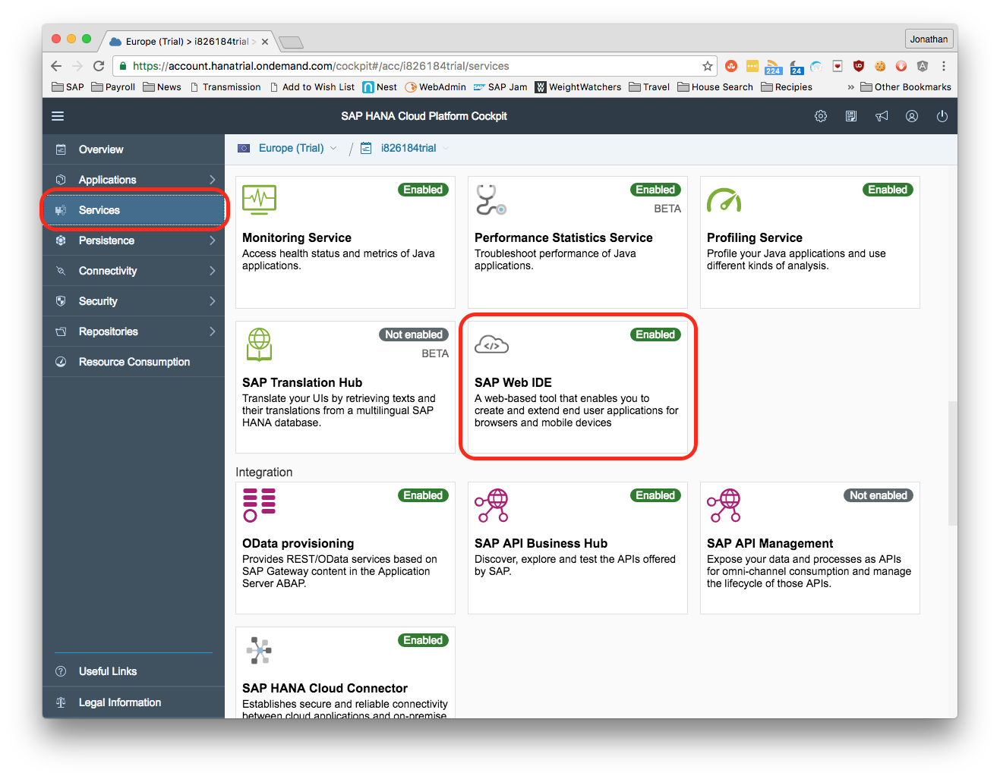

3.  In the SAP Web IDE screen, you will see a paragraph called *Service Description*.  At the bottom of the paragraph, there is a link called **Open SAP Web IDE**.  Click this link

    

4.  A new tab (or window) will open, and the Web IDE will load.

    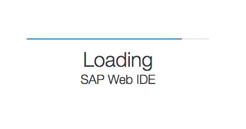

    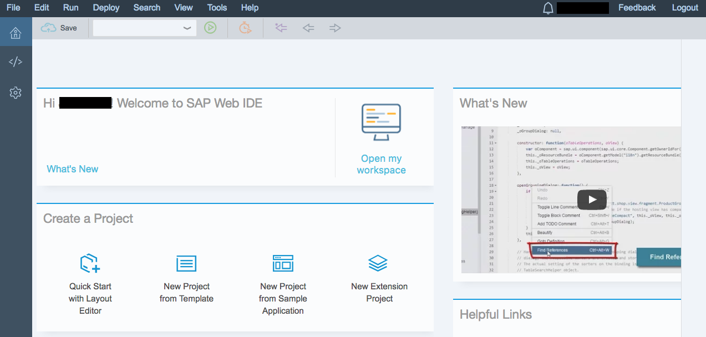

5.  Bookmark this page in your browser.  **You will need this link later, to reopen the Web IDE**.

---

### Set up a new empty web project

1.  Start by going to the **File** menu, and then choose **New** --> **Project From Template**.

    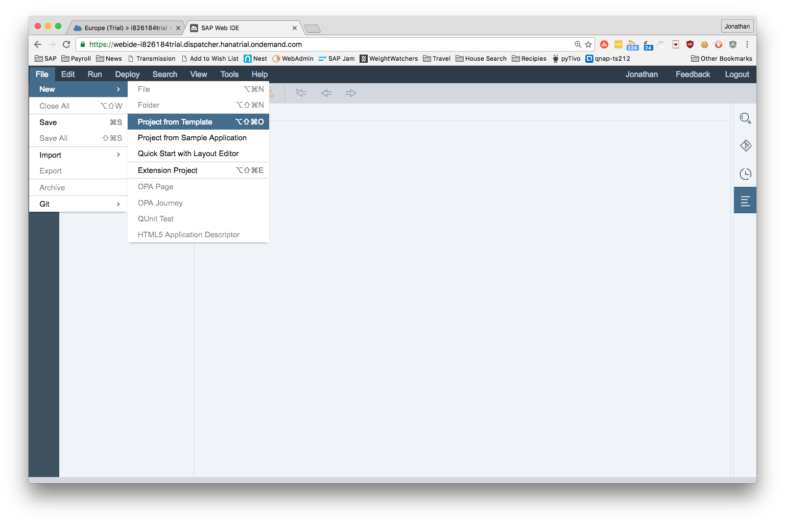

2.  Choose *SAPUI5 Application*, and then click **Next**.

    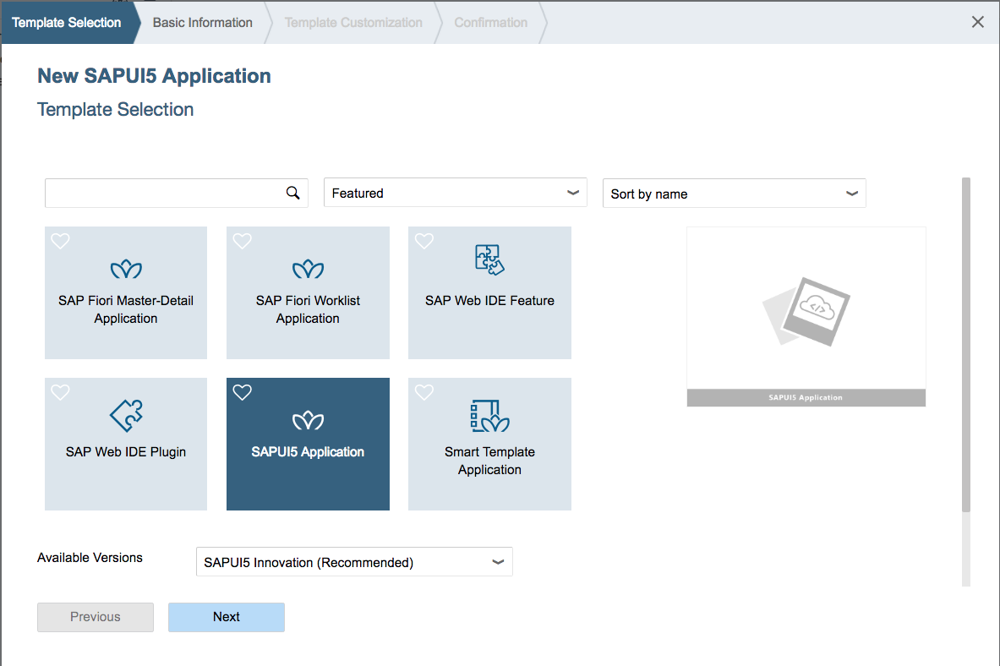

3.  Enter `HelloAngular` as a project name, and then click **Finish**.

    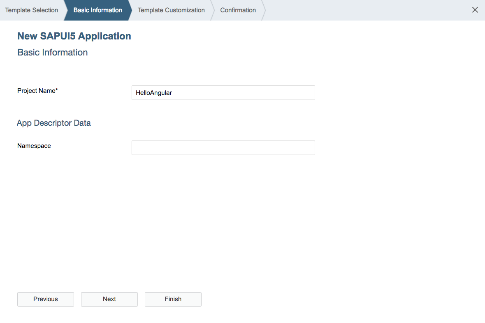

4.  Finally, we will be removing *all* of the files from your application.  Select the folder `webapp`, and the files `.project.json` and `neo-app.json`, then right click and choose **Delete**.

    >**Wait, what!!** For this AngularJS application, we will not need the files to support SAPUI5.  We will only be using the editor, and the built-in web server, for our application.  Everything else is downloaded directly from the web.

    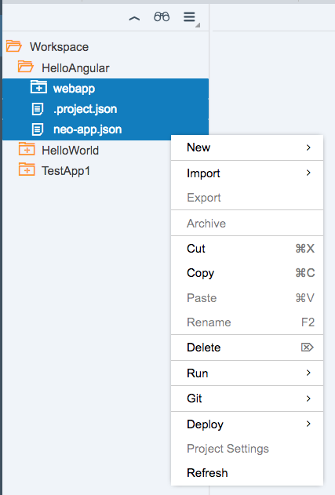

5.  In the dialog box, choose **OK**.

    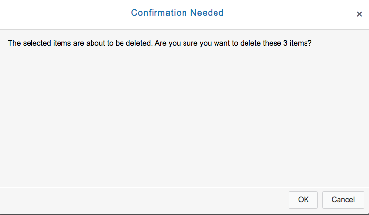

6.  Now, select the folder `HelloAngular`, right click, and select **New** --> **File**.

    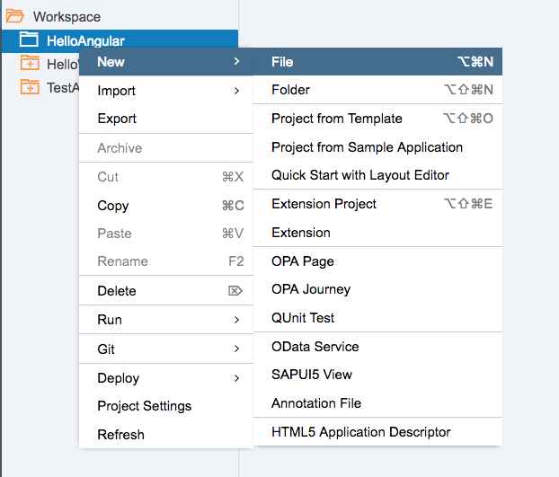

7.  Name the file `index.html`, and then click **OK**

    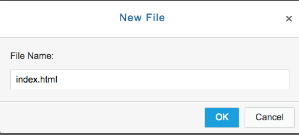

8.  The editor will open.  Copy and paste the following HTML in to the editor, then click the **Save**  button at the top.

    ```html
    <!DOCTYPE HTML>
    <html lang="en">

    <head>
    </head>

    <body>
        Hello Angular!
    </body>

    </html>
    ```

    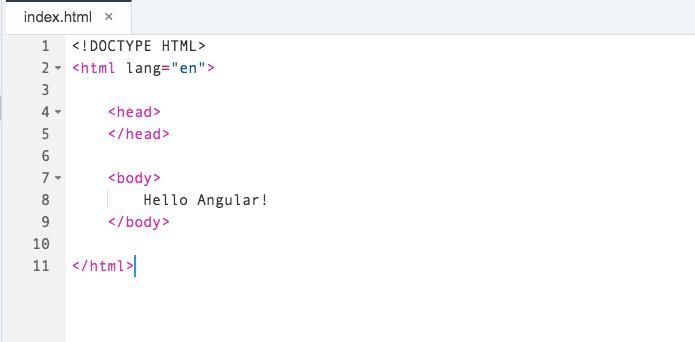

9.  Now try out your new web application!  Click on the *Run*  icon at the top of the page (or go to the **Run** menu, and choose **`Run index.html`**).

    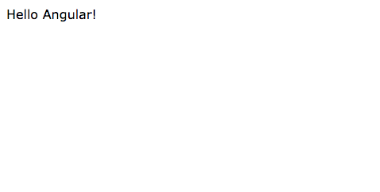


### Additional Information
**Why are we using Web IDE?  Can I use another development tool?**

Yes, you can.   We are using Web IDE because it provides an unlimited, free, developer account.  It also has a built-in web front end, so that you can test your code immediately.  And, it has a pretty good HTML and JavaScript editing system.  But there are plenty of other development IDE's, including Eclipse, that would work as well.  Feel free to use the one that your company is using, or try out a new one.

## Next Steps
 - **Tutorials:** [Create the Bootstrap Template](http://www.sap.com/developer/tutorials/angular-bootstrap-template.html)
