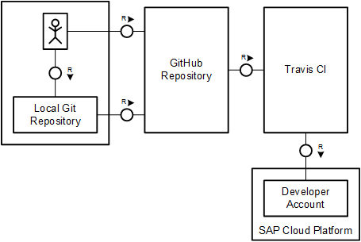
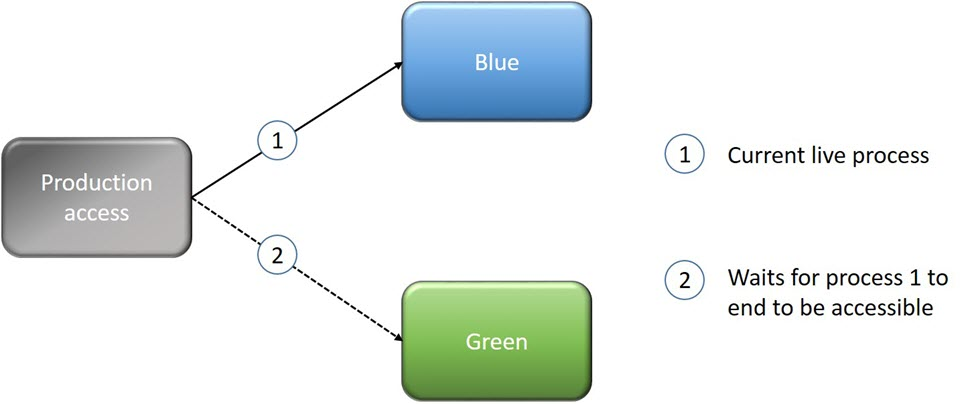
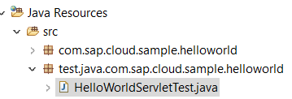
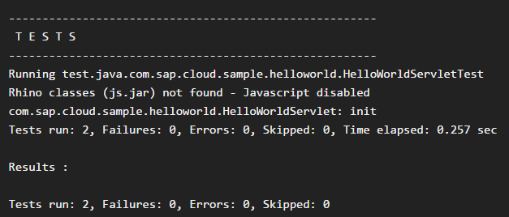

---

title: Continuous Integration (CI) Best Practices with SAP: Java Web on SAP Cloud Platform using a Cloud-based Build Service
description: Part 5.2: Configuring Cloud-based Build System for Maven-based Java Web on SAP Cloud Platform project.
primary_tag: products>sap-cloud-platform
tags: [  tutorial>intermediate, tutorial:type/project ]

---

## Prerequisites

  - **Proficiency:** Intermediate
  - [Generic Project with CI on Cloud](http://www.sap.com/developer/tutorials/ci-best-practices-generic-cloud.html)
  
---


### 1. Introduction

This section is a continuation of the discussion in [Generic Project (Pure Java) Using Cloud Services](http://www.sap.com/developer/tutorials/ci-best-practices-generic-cloud.html), applying the approach using GitHub and Travis CI as cloud services to process sample code that is delivered as part of the SDK installation for Java Web development. The sample discussed here contains some web applications that are built using Maven and share a common parent `pom.xml` file. Documentation and resources for Java web application development include the following:

> [Java: Getting Started](https://help.sap.com/viewer/65de2977205c403bbc107264b8eccf4b/Cloud/en-US/e66f3eecbb5710148397a19b46c4979b.html)  
> [Tutorial: Developing and deploying a basic Java application on SAP Cloud Platform](https://www.sap.com/developer/tutorials/hcp-java-basic-app.html)  
> [Installing the SDK](https://help.sap.com/viewer/65de2977205c403bbc107264b8eccf4b/Cloud/en-US/7613843c711e1014839a8273b0e91070.html)  
> [SDK Download](https://tools.hana.ondemand.com/#cloud)
 
This section goes beyond the pure build and describes how to add a post-build step to deploy the application to SAP Cloud Platform.



Figure 1: Landscape using GitHub and Travis CI

This section also explains the best practices with respect to the Travis CI integration and Maven application deployment on SAP Cloud Platform for Blue-Green deployment. In simple terms, Blue-Green deployment is a deployment technique that ensures less downtime by running two processes called Blue and Green in the same instance. At any time, only one of the processes (Blue) will be available for access while the other (Green) is ready for the Blue process to get closed. The same is illustrated below:



Figure 2: Blue-Green deployment

SAP Cloud Platform offers two ways of achieving zero downtime Blue-Green deployment for upgrading the application. 

1. Manual – Involves manually enabling/disabling the processes of the application. This step provides a better control over the processes and offers the choice of time to enable the new version.

2. Automatic – Also called 'rolling update'. The entire process switch is automated. The system automatically chooses the processes of the old version and disables the same while enabling the new version instantaneously.

In this document, we implement the automatic, rolling update.


### 2. Prerequisites

- Two different accounts on SAP Cloud Platform: QA and Production. The production account should have at least 3 compute units available at the time of deployment. This is required to perform the Blue-Green deployment.

- The sample application is deployed in the SAP Cloud Platform Production account. The application must be deployed with the minimum process set as 3 using the `-m` parameter in the `neo` command.

    > [`neo` deploy command](https://help.sap.com/viewer/65de2977205c403bbc107264b8eccf4b/Cloud/en-US/937db4fa204c456f9b7820f83bc87118.html)


### 3. Basic Setup


Follow the instructions for creating the GitHub project and a Travis CI build as described in [Generic Project (Pure Java) Using Cloud Services](http://www.sap.com/developer/tutorials/ci-best-practices-generic-cloud.html). As sources, use a sample project from the `samples` folder of the SAP Cloud Platform SDK installation zip that you can download from the link below.

> [Installing the SDK](https://help.sap.com/viewer/65de2977205c403bbc107264b8eccf4b/Cloud/en-US/7613843c711e1014839a8273b0e91070.html)  
> [SDK Download](https://tools.hana.ondemand.com/#cloud)

This example uses the project name `java_sapcp_project`.

The following illustration depicts the flow implementing the CI/CD process:


Figure 3: The CI/CD process flow


#### Procedure

1. In GitHub, create a new repository named `java_sapcp_project` and clone it to your local machine as described in [Generic Project (Pure Java) Using Cloud Services](http://www.sap.com/developer/tutorials/ci-best-practices-generic-cloud.html), steps 1-3.

2. The `samples` folder in the SAP Cloud Platform SDK contains a Maven parent project that includes a couple of modules. Copy the sources of this Maven project into your cloned `java_sapcp_project` repository root folder. For this example, we are going to use only the `hello-world` module; use comments in the parent `pom.xml` file to not include the other modules in the Gerrit project:

    ```
    <modules>
    <!--
        <module>...
           ...</module>
    -->
        <module>hello-world</module>
    <!--
        <module>...
           ...</module>
    -->
    </modules>
    ```

3. Continue setting up the GitHub project and Travis CI build as described in [Generic Project (Pure Java) Using Cloud Services](http://www.sap.com/developer/tutorials/ci-best-practices-generic-cloud.html), steps 5-10. The result is a successful build of the `explore-ui5` application on Travis CI.


### 4. Deployment to SAP Cloud Platform

The tools that are required for deployment to SAP Cloud Platform are already referenced in the project's `pom.xml` file. The next step is to configure the deployment parameters.


#### Procedure

1. In the sources of the sample project, open the parent `pom.xml` file.

2. In the property definition, change the value of `${sap.cloud.sdk.path}` as follows:

    ```
    ...
      <properties>
        ...
        <sap.cloud.sdk.path>${project.build.directory}/sdk</sap.cloud.sdk.path>
        ...
      </properties>
    ...
    ```
    
    The above step ensures that the 'Neo SDK' is installed in the project directory to be access by the Maven goals. 

3. The profile `cloud-integration-tests` is used for automated testing and deployment to the QA account. In the section of `pom.xml` that defines the profile `cloud-integration-tests`, add the following lines to define the SDK installation directory:

    ```
    ...
      <profile>
        <id>cloud-integration-tests</id>
        <build>
          <plugins>
            <plugin>
              <groupId>com.sap.cloud</groupId>
              <artifactId>${sap.cloud.sdk.plugin}</artifactId>
              <executions>
                ...
                <execution>
                  <phase>initialize</phase>
                  <goals>
                    <goal>install-sdk</goal>
                  </goals>
                </execution>
                ...
              </executions>
              ...
            </plugin>
            ...
          </plugins>
        </build>
      </profile>
    ...
    ```
     
    > [Installing the SAP Cloud Platform SDK](https://help.hana.ondemand.com/mavenSite/usage.html)

    The profile `cloud-integration-tests` must also contain the Maven steps to deploy and restart the application in the QA environment. Include the following executions as part of the `${sap.cloud.sdk.plugin}` plugin configuration inside the profile.
    
    ```
    <execution>
      <id>deploying-application</id>
      <phase>package</phase>
      <goals>
        <goal>run-console-command</goal>
      </goals>
      <configuration>
        <!-- Following console command is used to deploy the application to the QA environment -->
        <consoleCommand>deploy -a ${sap.cloud.account} -b ${sap.cloud.application} -h ${sap.cloud.host} -u ${sap.cloud.username} -p ${sap.cloud.password} -source ${project.build.directory}/${project.artifactId}.war</consoleCommand>			              
      </configuration>
    </execution>
    <execution>
      <id>restart-application</id>
      <phase>package</phase>
      <goals>
        <goal>run-console-command</goal>
      </goals>
      <configuration>
        <!-- The console commandis used to restart the application inorder to reflect the changes -->
        <consoleCommand>restart -a ${sap.cloud.account} -b ${sap.cloud.application} -h ${sap.cloud.host} -u ${sap.cloud.username} -p ${sap.cloud.password}</consoleCommand>			              
      </configuration>
    </execution>
    ```

    Once the tests on the QA account pass, the profile `update`, which is described in the next section is used to deploy the application onto the production environment. Maven executes the deployment to production only if the test has passed before thus ensuring Continuous Deployment.

      
4. The rolling update on the Production account is handled by profile `update`. It ensures that the current running process is shut down gracefully before enabling the updated application's process running live.

    > [Console Client Commands: rolling-update](https://help.sap.com/viewer/65de2977205c403bbc107264b8eccf4b/Cloud/en-US/3f5d41207b6a4d0b9ad2e46dc6f27e69.html).

    Add the following new profile to the `pom.xml` file:

    ```
    ...
      <profile>
        <id>update</id>
        <build>
          <plugins>
            <plugin>
              <groupId>com.sap.cloud</groupId>
              <artifactId>${sap.cloud.sdk.plugin}</artifactId>
              <executions>
                <!-- This Execution is required to install the SDK -->
                <execution>
                 <phase>initialize</phase>
                 <goals>
                  <goal>install-sdk</goal>
                 </goals>
                </execution>
                <!-- This Execution is used to run the rolling-update command for Blue-Green deployment -->
                <execution>
                  <id>deploying-application</id>
                  <phase>package</phase>
                  <goals>
                    <goal>run-console-command</goal>
                  </goals>
                  <configuration>
                    <consoleCommand>rolling-update -a ${sap.cloud.account} -b ${sap.cloud.application} -h ${sap.cloud.host} -u ${sap.cloud.username} -p ${sap.cloud.password} -source ${project.build.directory}/${project.artifactId}.war</consoleCommand>                 
                  </configuration>
                </execution>
              </executions>
         	    <configuration>
                <skip>${skipIntegrationTests}</skip>
                <sdkInstallPath>${sap.cloud.sdk.path}</sdkInstallPath>
              </configuration>
            </plugin>
          </plugins>
        </build>
      </profile>
    ...
    ```

Note that, for the rolling update to be executed successfully, the minimum number of processes that needs to be configured at the time of deployment is 3. The reason is that the current running process (Blue) takes up one process and the new process to be run (Green) needs one more along with the units to process the rolling update. 


### 5. Configure the Travis build and make the `pom.xml` file configurable through the environment.

Travis CI enables you to customize the build, that is, to define environment variables, which control the deploy target. We will use those variables to provide the SAP Cloud Platform account and credentials.


#### Procedure

1. Open the `pom.xml` file and make the following changes in the `properties` section:
     
    ```
    ...
      <properties>
      ...
        <sap.cloud.host>${env.SAP_CLOUD_HOST}</sap.cloud.host>
        <sap.cloud.account>${env.SAP_CLOUD_ACCOUNT}</sap.cloud.account>
        <sap.cloud.username>${env.SAP_CLOUD_USERNAME}</sap.cloud.username>
        <sap.cloud.password>${env.SAP_CLOUD_PASSWORD}</sap.cloud.password>
        <sap.cloud.application> - name of your application - </sap.cloud.application>
      ...
      </properties>
    ...
    ```
    
    This ensures that the SAP Cloud Platform access information is taken from the build environment, and we don't need to include them in the `pom.xml` file.

    The account password will be encrypted and defined as part of the global environment variables in the file `.travis.yml` in one of the steps below.
  
2. Add the following line, which forces Travis to call Maven using the correct profile, to the file `.travis.yml`:

    ```
    script:
    - mvn clean install -P cloud-integration-tests -Denv.SAP_CLOUD_HOST=$SAP_CLOUD_HOST -Denv.SAP_CLOUD_ACCOUNT=$SAP_CLOUD_ACCOUNT -Denv.SAP_CLOUD_USERNAME=$SAP_CLOUD_USERNAME -Denv.SAP_CLOUD_PASSWORD=$SAP_CLOUD_PASSWORD
    ```
    
    The above script executes the Unit tests and upon successful test execution, it deploys the application to the QA account.
    
    To trigger the deployment of the application to the Production account, include the following line into `.travis.yml`:

    ```
    after_success: 
    - mvn clean install -P update -Denv.SAP_CLOUD_HOST=$SAP_CLOUD_PROD_HOST -Denv.SAP_CLOUD_ACCOUNT=$SAP_CLOUD_PROD_ACCOUNT -Denv.SAP_CLOUD_USERNAME=$SAP_CLOUD_PROD_USERNAME -Denv.SAP_CLOUD_PASSWORD=$SAP_CLOUD_PROD_PASSWORD
    ```
    
    The `PROD_*` variables are part of the settings in Travis CI as mentioned in the step below. 

3. Open Travis CI and go to your project. Select **More options > Settings** and add the values below. You must switch off **Display value in build log** to avoid making your settings public.

    Field                     | Value                               
    :------------------------ |:------------------------------------
    `SAP_CLOUD_USERNAME`      | `<The user name of your SAP Cloud Platform QA account>`
    `SAP_CLOUD_ACCOUNT`       | `<The name of your SAP Cloud Platform QA account>`
    `SAP_CLOUD_HOST`          | `hana.ondemand.com`
    `SAP_CLOUD_PROD_USERNAME` | `<The user name of your SAP Cloud Platform Production account>`
    `SAP_CLOUD_PROD_ACCOUNT`  | `<The name of your SAP Cloud Platform Production account>`
    `SAP_CLOUD_PROD_HOST`     | `hana.ondemand.com`

    Although the environment variables are not visible, they are stored in clear text; the SAP Cloud Platform password must not be handled like this, so the next step is to encrypt it properly.

4. On your local machine, install Ruby and the Travis command line client:

    > [Travis Documentation: Encryption keys](https://docs.travis-ci.com/user/encryption-keys/)

5. In your local clone of the GitHub repository, execute the following command in the directory where the `.travis.yml` file is located:
  
    ```
    travis encrypt SAP_CLOUD_PASSWORD={your SAP Cloud Platform QA password} --add env.global
    ```

    This command automatically adds an encrypted environment entry into the `.travis.yml` file. The content of `travis.yml` should look like the following:
     
    ```
    sudo: false
    jdk: oraclejdk7
    script: mvn install -P cloud-integration-tests
    env:
      global:
        secure: SdKbOJMBDLU4W6GJfK0n...
    ```

    Repeat the same for the credentials for the Production account:

    ```
    travis encrypt SAP_CLOUD_PROD_PASSWORD={your SAP Cloud Platform Production password} --add env.global
    ```
     
6. Open Travis CI and go to your project. Select **More options > Settings**, switch **Limit concurrent jobs** on and enter `1` as the value to prevent concurrent builds from colliding with the deployments on SAP Cloud Platform.
  
    

    > [Travis Documentation: Customizing the Build](https://docs.travis-ci.com/user/customizing-the-build)
    
7. Use Git to commit the changes, then push them to GitHub. Monitor the statuses of the build in Travis CI and of the application in the SAP Cloud Platform Cockpit.


### 6. Automation of Unit tests in Maven

Unit tests are used to scrutinize classes individually and independently for proper operations. JUnit is one of the unit testing frameworks that can be integrated with Maven for test automation. The sample project that is imported already contains the Integration test and Unit test using EasyMock and ServletUnit.

#### Procedure

1. The test classes need to be added under the `test` package as shown below:

    

2. Once the test classes are ready, the same can be automated in the Maven build by including the dependency in the `pom.xml`:

    ```
    ...
    <dependencies>
    ...
      <dependency>
        <groupId>junit</groupId>
        <artifactId>junit</artifactId>
        <version>4.11</version>
      </dependency>   
    ...
    </dependencies>
    ...
    ```

3. While Travis CI builds Maven, the test cases are executed as part of the Maven build. A successful test execution is displayed in the build log as follows:

    

    If the JUnit test case fails, the deployment phase in the Maven build is interrupted. 


### 7. Further Refinements

1. If you have more than one parallel build:  
    In the example, the number of parallel builds is restricted to one to avoid conflicts in deployment. You can circumvent this restriction by providing dynamic names for the deployed application. In the property definition block of the `pom.xml` file, apply the following change:  

    ```
    <sap.cloud.application>${env.TRAVIS_BRANCH}${env.TRAVIS_BUILD_NUMBER}</sap.cloud.application>
    ```

    The application name is generated from the branch and the build number. Any build produces a unique application name that is also well-categorized by branch. Ensure that the resulting name adheres to the application naming rules for SAP Cloud Platform.  
     
    > [Console Client Commands: deploy](https://help.sap.com/viewer/65de2977205c403bbc107264b8eccf4b/Cloud/en-US/937db4fa204c456f9b7820f83bc87118.html)
     
2. Restricting builds for branches:  
    If only a few branches should be built automatically, add a build restriction into the `.travis.yml` file as shown here:

    ```
    branches:
      only:
        - master
    ```
     
    > [Travis Documentation: Building Specific Branches](https://docs.travis-ci.com/user/customizing-the-build/#Building-Specific-Branches)

More sophisticated control mechanisms are provided by Travis' build matrix:

> [Travis Documentation: Build Matrix](https://docs.travis-ci.com/user/customizing-the-build/#Build-Matrix)
  

## Next Steps

  - [Back to the Navigator](http://www.sap.com/developer/tutorials/ci-best-practices-intro.html)
  
