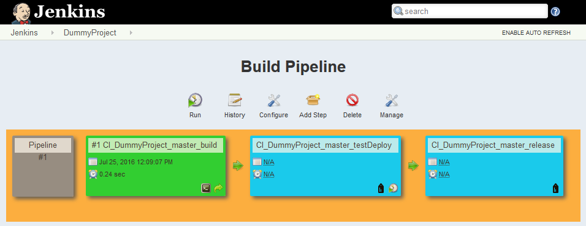
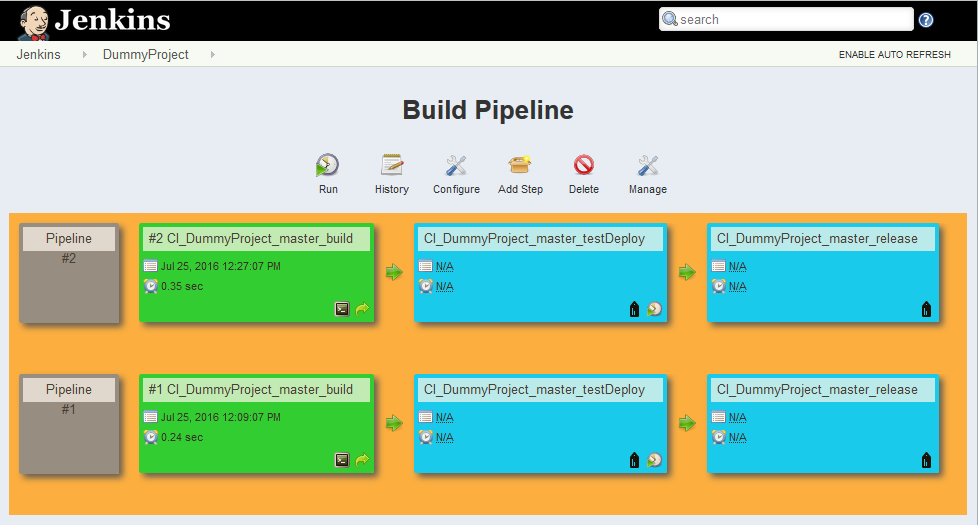
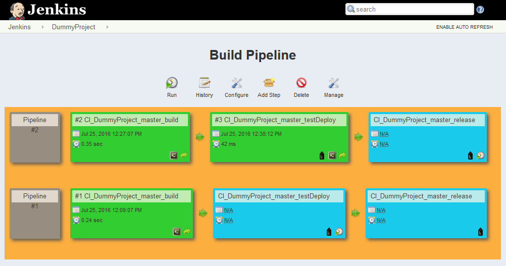
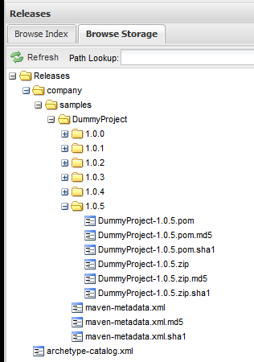
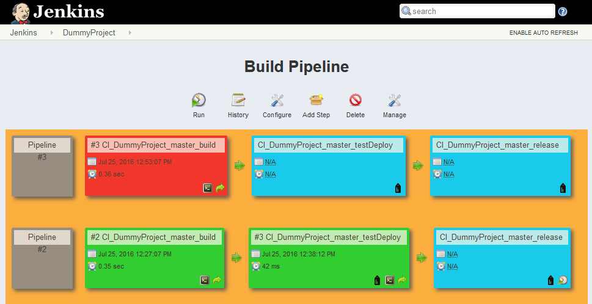

---

title: Continuous Integration (CI) Best Practices with SAP: Pipeline Skeleton Configuration
description: Part 3.5: Configuring a CD Pipeline Skeleton.
primary_tag: products>sap-cloud-platform
tags: [  tutorial>intermediate, tutorial:type/project ]

---

## Prerequisites  

  - **Proficiency:** Intermediate
  - [Source Code Versioning System](http://www.sap.com/developer/tutorials/ci-best-practices-scm.html)  
  - [Build Scheduler](http://www.sap.com/developer/tutorials/ci-best-practices-build.html)  
  - [Artifact Repository](http://www.sap.com/developer/tutorials/ci-best-practices-artifacts.html) 
  - [Landscape Configuration](http://www.sap.com/developer/tutorials/ci-best-practices-landscape.html)


## Next Steps

  - [Back to the Navigator](http://www.sap.com/developer/tutorials/ci-best-practices-intro.html)
  
---

> This document is part of the guide Continuous Integration (CI) Best Practices with SAP. For all the examples to work properly make sure that you have followed the setup instructions for all components listed in the prerequisites box. Depending on the release of the components, the front ends may look different in your concrete setup.


### 1. Introduction

This part discusses how you can use Jenkins to set up a continuous delivery pipeline skeleton, which includes an automatically triggered CI build job (including automatic tests), a manual step to deploy the build result to a test system and an additional manual step that releases and deploys changes to the production system. The project name used throughout this discussion is `DummyProject`. 

The full continuous delivery scenario consists of the following steps:

1. The developer makes a change in the source files and pushes it to the central Gerrit instance for review.

2. A reviewer submits the change in Gerrit with the status `merged`. Although, as it was pointed out in the part [Pipeline Suggestions](http://www.sap.com/developer/tutorials/ci-best-practices-pipelines.html), it makes sense to create voter builds, they are not actually a part of a continuous delivery pipeline, since they run as pre-validation processes before the change reaches the master branch. Therefore, voter builds are not described here.

3. A CI build job, named `CI_DummyProject_master_build` for the purpose of this discussion, is triggered automatically as soon as the change is merged into the `master` branch. Typically, the CI build job contains automatic tests, static code checks and so on as required. 

4. The build artifact is archived and used in eventual sequel steps that take place at the end of the job `CI_DummyProject_master_build`. At this point, the change has been reviewed, successfully built and, automatically tested. It is now a candidate for acceptance tests.
    
5. Acceptance tests are often performed manually, and not all candidates (many may be created each day) will undergo this procedure, due to resource constraints. Acceptance tests are scheduled, for example, on a daily basis, taking one of the available candidates. In most cases, a quality manager or test coordinator selects or specifies a candidate and triggers the deployment to a test system. In our example, this is done by starting the job `CI_DummyProject_master_testDeploy`. After deployment, the test system generally remains stable for the rest of the day in the sense that no other candidates are deployed. However, if a candidate fails early and there is time enough to start the procedure once again on the same day, another candidate might be deployed.

6. Upon completion of a successful acceptance test, the change can be (but doesn't have to be) released. This again is a conscious manual process triggered by the quality or release manager depending on the outcome of the tests. With the release, the artifact is uploaded to the Nexus repository. In our example, this is performed by the job `CI_DummyProject_master_release`.


Figure: Process Sequence

The next several procedures show how to create the jobs and orchestrate them using the features of Jenkins. They are intended to provide an idea of the principles and do not include technical specifics of any build tooling. That is, jobs are created as skeletons, which aren't intended to be fully implemented successfully. You can find concrete implementations in the sections that discuss the CI/CD processes for SAP-specific technologies. 

Maven is used explicitly in only one place: uploading the released artifact to Nexus. For convenience, artifact metadata is stored in a `pom.xml` file such that passing the metadata as parameters to the `mvn deploy` call is unnecessary. Other implementations that do not use Maven are also possible.


### 2. Prerequisites

- Running Git/Gerrit instance
- Running Jenkins master and a Jenkins build slave 
- Running Nexus instance that hosts at least one snapshot repository
- Git installation on your local machine


### 3. Setting up a Dummy Gerrit Project

Since the CD process is triggered by a source change, a Git repository is required.

#### Procedure

1. In your browser, access the Gerrit on port 8080.

2. Log in as the admin user.

3. Select **Projects > Create New Project**.

4. Enter the following data: `DummyProject` as **Project Name**, `CI-Projects` as **Rights Inherit From**, and select **Create initial empty commit**. This automatically creates the `master` branch.  
    Click **Create Project**. 
    
5. On the page appearing now (to which you may navigate later via the **General** tab), you find the `git clone` command including the URL of your Gerrit project.

6. Using the `git clone` command, perform an initial clone of the project to your PC and check out the `master` branch.

7. Add the following `pom.xml` file into your project folder:

    ```
    <project xsi:schemaLocation="http://maven.apache.org/POM/4.0.0 http://maven.apache.org/xsd/maven-4.0.0.xsd">
      <modelVersion>4.0.0</modelVersion>
      <groupId>company.samples</groupId>
      <artifactId>DummyProject</artifactId>
      <version>1.0.0</version>
    </project>
    ```

8. Add `pom.xml` in Git, then commit and push the change:

    ```
    git add .
    git commit -m "add pom.xml"
    git push origin master:master
    ```


### 4. Setting up the CI Build

A CI build - the build itself, automatic tests, and artifact archiving - is directly triggered when a change is merged into the `master` branch.


#### Procedure

1. Open the Jenkins front end. 

2. Select **New Item > Freestyle project** and enter `CI_DummyProject_master_build` as the project name.

    

3. If your Jenkins setup has slaves, select **Restrict where this project can be run** and enter `builds`. Otherwise, do not select.
  
4. In the **Source Code Management** section, enter the following values:

    Field                                  | Value
    :------------------------------------- | :------------------------------------------------------------------------- 
    Git                                    | `checked` 
    Repository URL                         | `<the SSH-based URL of your repository>` 
    Credentials                            | `jenkins` 
    Branches to build; Branch Specifier    | `master`

5. In the **Build Triggers** section, select **Poll SCM** and enter a pull frequencies as **Schedule**. For immediate results, every two minutes is an appropriate value.

6. In the **Build Environment** section, select **Delete workspace before build starts**.
    
7. In the **Build** section, select **Add build step > Execute shell**  and enter the following script:

    ```
    mkdir target
    touch target/build_result.zip
    cp pom.xml target
    ```
    
    This operation simulates a build with a result located in the `target` folder. The `pom.xml` file is copied to the `target` folder, and the metadata is made accessible to subsequent jobs.
    
8. Select **Add post-build action > Archive the artifacts**. Enter `target/*`.

9. Select **Add post-build action > Build other projects (manual step)**. Enter `CI_DummyProject_master_testDeploy` as the downstream project name. You see a warning message, as the project does not yet exist. You can safely ignore the warning.
    
10. Save.


### 5. Setting up the Test Deploy Job

The test deploy job must be manually triggered, but is semantically linked to the previous job.


#### Procedure

1. Open the Jenkins front end. 

2. Select **New Item > Freestyle project** and enter `CI_DummyProject_master_testDeploy` as the project name.

3. If your Jenkins setup has slaves, select **Restrict where this project can be run** and enter `builds`. Otherwise, do not select.

4. In the **Source Code Management** section, select **None**

5. In the **Build Environment** section, select **Delete workspace before build starts**.
  
6. In the **Build** section, select **Add build step > Copy artifacts from another project**.

5. Enter the following values:

    Field                                  | Value
    :------------------------------------- | :------------------------------------------------------------------------- 
    Project name                           | `CI_DummyProject_master_build`
    Which build                            | `Upstream build that triggered this job`
    Artifacts to copy                      | `target/*`
    
6. Select **Add build step > Execute shell** and enter the following script:

    ```
    echo "Now a real job would deploy the artifact to the test system."
    ```

7. Select **Add post-build action > Build other projects (manual step)**. Enter `CI_DummyProject_master_release` as the downstream project name. You see a warning message, as the project does not yet exist. You can safely ignore the warning. 

8. Save.


### 6. Setting up the Release Job

The release job must be manually triggered, but is semantically linked to the previous job.

#### Procedure

1. Open the Jenkins front end.

2. Select **New Item > Freestyle project** and enter `CI_DummyProject_master_release` as the project name.

3. If your Jenkins setup has slaves, select **Restrict where this project can be run** and enter `builds`. Otherwise, do not select.

4. In the **Source Code Management** section, select **None**

5. In the **Build Environment** section, select **Delete workspace before build starts**.
  
6. In the **Build** section, select **Add build step > Copy artifacts from another project**.

7. Enter the following values:

    Field                                  | Value
    :------------------------------------- | :------------------------------------------------------------------------- 
    Project name                           | `CI_DummyProject_master_build`
    Which build                            | `Upstream build that triggered this job`
    Artifacts to copy                      | `target/*`

8. Select **Add build step > Execute shell** and enter the following script:

    ```
    echo "Now a real job would deploy the artifact to the production system."
    mv target/pom.xml .
    mvn deploy:deploy-file -Durl=http://<enter your nexus host here>:8081/nexus/content/repositories/releases -Dfile=target/build_result.zip -DrepositoryId=<your repository Id> -Dpackaging=zip -DpomFile=pom.xml

    ```

    According to the example described in [Landscape Configuration](http://www.sap.com/developer/tutorials/ci-best-practices-landscape.html) the value of `<your repository Id>` is `nexus1`.

      
9. Save.


### 7. Creating a View to the Pipeline

So far, the implementation has consisted of separate process steps that are connected to each other. You can visualize the pipeline by using the Jenkins Build Pipeline Plugin.

#### Procedure

1. Open the Jenkins front end.

2. Select the view tab that contains the `+` sign.

3. Provide a name for the new view, for example `DummyProject_pipeline`. 

4. Then select **Build Pipeline View**. Press **OK**.

5. In the Layout section, in the **Select Initial Job** field, enter the CI build job name (`CI_DummyProject_master_build`).

6. Enter an appropriate value in **No Of Displayed Builds** (we suggest starting with `5`).

7. Press **OK**.

You should now see a pipeline that looks similar to that shown below. It is likely that the first run of the build job has already finished since it fetched the first initial commit immediately after it was defined.
    

    
    
### 8. One Round-Trip Through the Process

After setting up the continuous delivery pipeline, try performing a round-trip through the process.

#### Procedure

1. On your local PC, add a file in the `DummyProject` and push it to `master` (for simplicity, we omit the voting on Gerrit). For example on a Linux workstation, change into your cloned repository and type:

    ```
    touch test.txt
    git add .
    git commit -m "Test Commit"
    git push origin master:master
    ```

2. After no longer than two minutes, the build job starts automatically. Upon successful completion, "something useful" has been built and tested.

    
    
3. For the example scenario, assume that the status shown in the picture above is what the quality manager or test coordinator sees upon entering the office in the morning. He or she decides what version is to be tested today and determines the artifact produced in pipeline #2. The pipeline view is interactive: select the trigger button in the bottom-right corner of the box representing the deploy job to the test system (`CI_DummyProject_master_testDeploy`).
    
4. The artifacts are deployed to the test system.

    

    To see that the artifacts were archived by the build job into the workspace of this job, select **Back to Project > Workspace**. There is a `target` folder containing the expected artifact.
    
    
    
5. After a successful test, the quality or release manager may decide to release the artifact, that is, deploy it to the productive system and trigger an upload to Nexus as a released version.
     
    
    
    As result, the artifact is available in Nexus.
    
    
    
In practice, only very few changes are finally released. The journey for most changes ends after the build step, since the build fails (indicating that the deploy step is not possible), the quality manager did not choose them for acceptance test execution, or the release manager decided not to release them.




> The content of this document is for guidance purposes only. No warranty or guarantees are provided.


## Next Steps

  - [Back to the Navigator](http://www.sap.com/developer/tutorials/ci-best-practices-intro.html)
