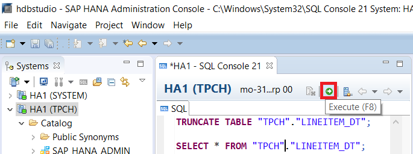
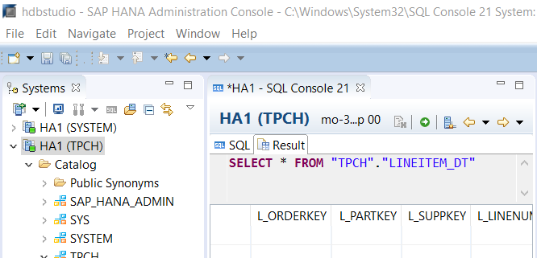
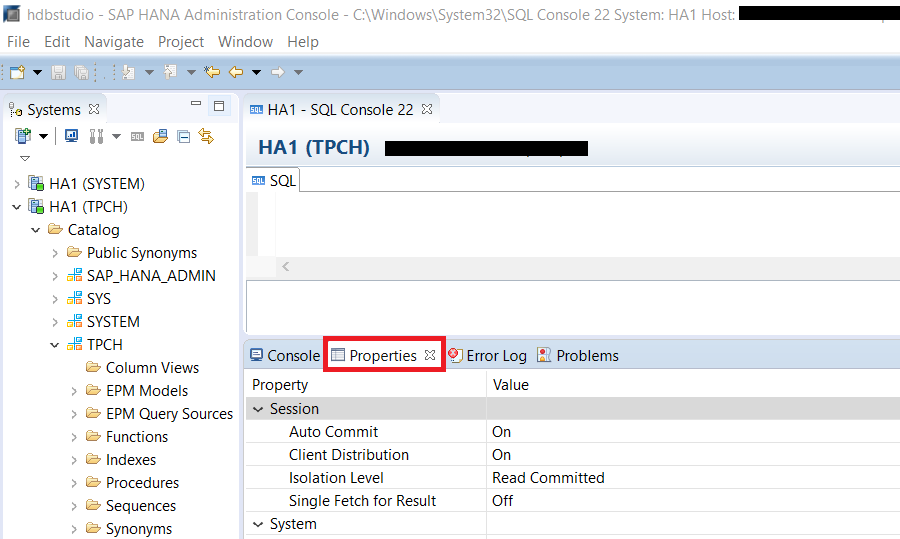
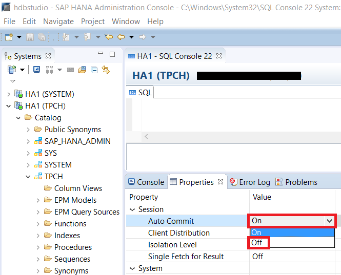
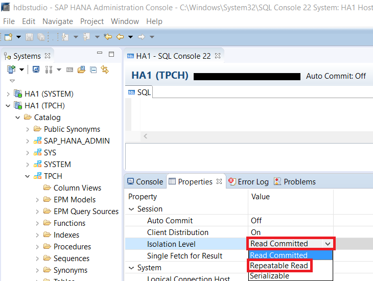
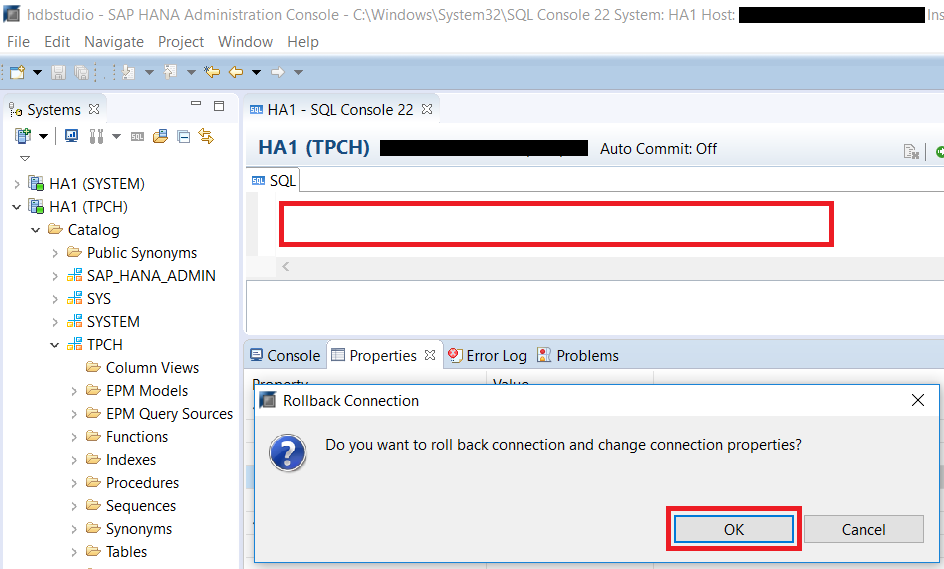
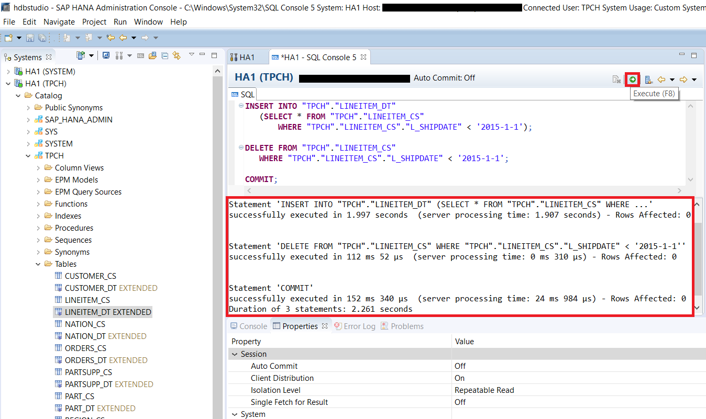
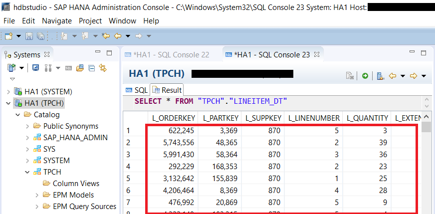
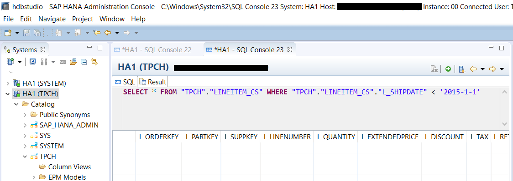

## Prerequisites
 - **Proficiency:** Beginner
 - **Tutorials:** [Converting Between an In-Memory Table and an Extended Table](http://www.sap.com/developer/tutorials/dt-create-schema-load-data-part4.html)

## Next Steps
 - **Tutorials:** [Migrate Records in Related Tables Using Stored Procedure](http://www.sap.com/developer/tutorials/dt-create-schema-load-data-part6.html)

## Details
### You will learn
 - Migrating data between in-memory and Dynamic Tiering table instances.
 - Setting "Auto Commit" and "Isolation Level" property values.

### Time to Complete
**10 Min**.

---

[ACCORDION-BEGIN [Step 1: ](Delete Data From Extended Tables)]
Currently the `LINEITEM_DT` table contains identical information to the `LINEITEM_CS` table. In order to easily be able to notice that data has been selectively moved from one table to another, we will first remove all data from the `LINEITEM_DT` table. To do so, copy and paste the script below into the SQL console. Then press the Execute button to delete the data in the table.

In **SAP HANA Administration Console** perspective, go to the **System** view on the left side. Select your system and open a SQL console.


``` sql
TRUNCATE TABLE "TPCH"."LINEITEM_DT";

SELECT * FROM "TPCH"."LINEITEM_DT";
```



The result should be empty to indicate the data has been deleted.



[DONE]
[ACCORDION-END]

[ACCORDION-BEGIN [Step 2: ](Turning off Auto Commit)]
By default, SQL Console connections from HANA Studio to your HANA system are created with the Auto Commit option turned "On". The Auto Commit option automatically issues a commit after each statement that is executed against the server. You need to change Auto Commit to "Off" in order to execute the migration script, which executes two statements, as a single atomic transaction.

Open a new SQL console connected to your system, right click on your system and select **Open SQL Console**.


To check and change the "Auto Commit" setting, click to open the **Properties** tab in the bottom right panel.



>Note: If the Properties tab is blank, double check that you are connected to a HANA server and then click inside the **Properties** tab to set the focus and press the **F5** function key to refresh the view.

Click on the value cell for **Auto Commit** and change it to **Off**.



[DONE]
[ACCORDION-END]

[ACCORDION-BEGIN [Step 3: ](Setting the Isolation Level)]
Database isolation levels determine how the database server handles concurrency when multiple users may be reading and writing to the database at the same time. The default isolation level is "READ COMMITTED" which ensures that any given statement only sees committed records. The "READ COMMITTED" isolation level does not ensure consistency between statements even within a single transaction.

Since the process of migrating data between in-memory and extended tables requires both an insert and a delete statement, you need to increase the isolation level to either "REPEATABLE READ" or "SERIALIZABLE" both of which ensure consistency across multiple statements within a single transaction.

Note:	Since HANA uses snapshot isolation, "REPEATABLE READ" and "SERIALIZABLE" isolation levels are identical. For more information on Isolation Levels in SAP HANA, see the [SET TRANSACTION Statement (Transaction Management)](https://help.sap.com/saphelp_hanaplatform/helpdata/en/20/fdf9cb75191014b85aaa9dec841291/content.htm).

To change the isolation level, click on the **Isolation Level** field in the **Properties** tab and choose **REPEATABLE READ**.



Left click on the SQL console, and you should be prompted by a "Rollback Connection" pop up. Click **OK** to set the isolation level.



[DONE]
[ACCORDION-END]

[ACCORDION-BEGIN [Step 4: ](Migrating Data)]
Copy and paste the script below into the SQL console. Press the Execute button to execute the migration. Ensure the entire script executed correctly. The script below copies records older than 2015-1-1 from the in-memory `LINEITEM_CS` table to the extended table `LINEITEM_DT` in Dynamic Tiering. It then deletes the moved records from the `LINEITEM_CS` table to free up storage space in-memory now that the data has been copied to Dynamic Tiering. The "`WHERE`" statement in the script is used to selectively choose data. Specifically, in the script above, the "`WHERE`" statement is used to select data from the `LINEITEM_CS` table whose "`L_SHIPDATE`" is before January 1st, 2015.

``` sql
INSERT INTO "TPCH"."LINEITEM_DT"
  (SELECT * FROM "TPCH"."LINEITEM_CS"
    WHERE "TPCH"."LINEITEM_CS"."L_SHIPDATE" < '2015-1-1');

DELETE FROM "TPCH"."LINEITEM_CS"
  WHERE "TPCH"."LINEITEM_CS"."L_SHIPDATE" < '2015-1-1';

COMMIT;
```

> Because you have turned off Auto Commit, you now need to explicitly commit the transaction yourself using the "COMMIT" statement.

Table `LINEITEM_CS` has records with ship dates ranging from Jan 2, 2012 (2012-1-2) to Dec 1, 2018 (2018-12-1). For the purpose of this lesson, you will be migrating records older than Jan 1, 2015 (2015-1-1) from the `ORDERS_CS` table to the `ORDERS_DT` table.



Verify that the data has been inserted into the **`LINEITEM_DT`** table either by executing the query below or by right clicking on the table in the catalogue and choosing **Open Data Preview**.

``` sql
 SELECT * FROM "TPCH"."LINEITEM_DT";
```



Verify that the data has been deleted from the **`LINEITEM_CS`** table by executing the query below and confirming that no records are returned.

``` sql
SELECT * FROM "TPCH"."LINEITEM_CS" WHERE "TPCH"."LINEITEM_CS"."L_SHIPDATE" < '2015-1-1';
```



[DONE]
[ACCORDION-END]

## Next Steps
- **Tutorials:** [Migrate Records in Related Tables Using Stored Procedure](http://www.sap.com/developer/tutorials/dt-create-schema-load-data-part6.html)
