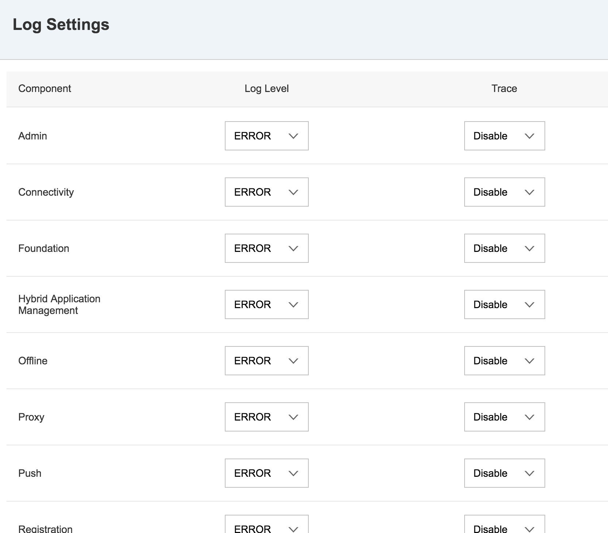
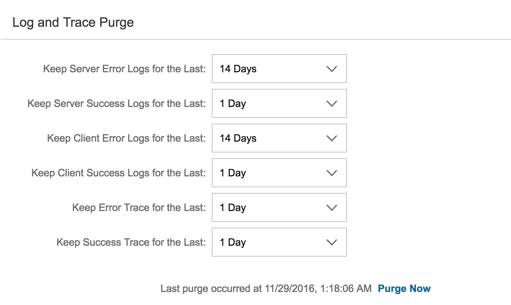
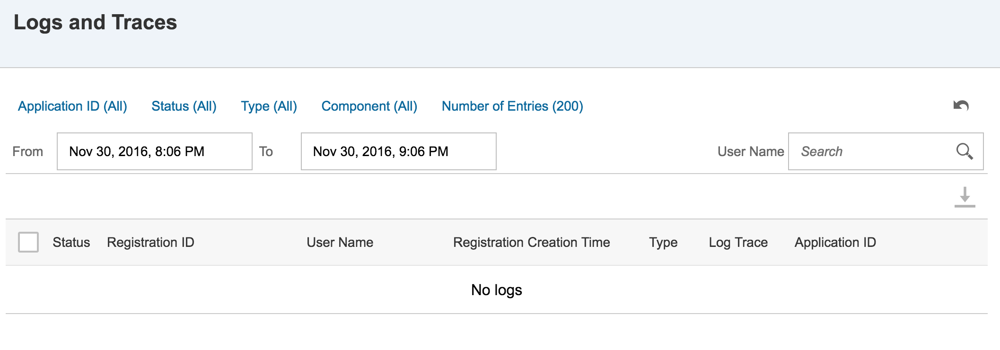
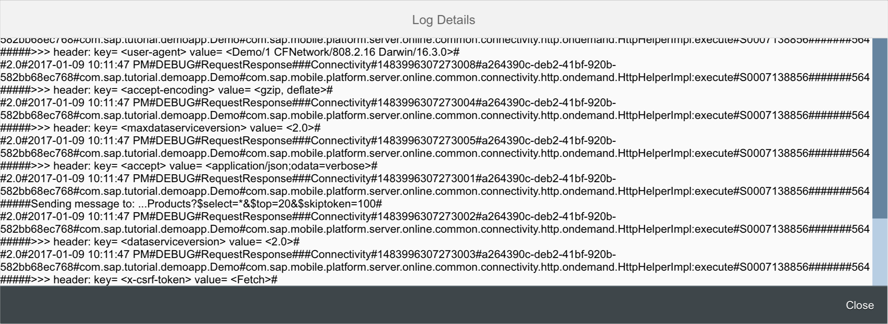

## Prerequisites  
 - **Proficiency:** Beginner
 - **Development machine:** Access to a Mac computer
 - **Tutorials:** [Application logging and tracing](https://go.sap.com/developer/tutorials/fiori-ios-hcpms-application-logging.html)

## Next Steps
 - [Manage usage statistics on SAP Cloud Platform Mobile Services](https://go.sap.com/developer/tutorials/fiori-ios-hcpms-reporting.html)

## Details
### You will learn  
In this tutorial, you will learn to use the logging functionality and configurations available in SAP Cloud Platform Mobile Services. You will also learn how to set logging levels, enable application traces, and view logs and traces.

### Time to Complete
**15 Min**.

---

SAP Cloud Platform, mobile service for development and operations provides administrators, developers and support staff with extensive logs and traces functionality to troubleshoot application issues. You can control the amount of information that is captured by setting the log level for individual logging components. Logs and traces are automatically synchronized with the server when an application is launched or switched to foreground or background on the client.

[ACCORDION-BEGIN [Step 1: ](Examine the SAP Cloud Platform Mobile Services log settings)]

Go to your [SAP Cloud Platform cockpit](https://account.hanatrial.ondemand.com) and log on. Navigate to **Logs > Log Settings**

In this screen, at the top part, you can set the **logging level** for each type of logging component, as well as **enabling application traces**:

> By default, log levels are set to `ERROR` and application traces are set to `Disable`. Lowering log levels and enabling traces can impact server performance. Generally, you should lower log levels and/or enable traces only when required for debugging or user support.

In the bottom part, you can specify the logging purge periods:

[DONE]
[ACCORDION-END]

[ACCORDION-BEGIN [Step 3: ](Change application log settings)]

For our application, set the following logging levels and application traces:

| Component | Log Level | Trace |
|----|----|----|----|
| Connectivity | DEBUG | Enable |
| Offline | INFO | Enable |
| Security | INFO | Disable |
| Statistics | INFO | Disable |

Click **Save** to store the changes, and navigate to **Logs > Log and Trace**.

By default, the log viewer displays logs and traces occurred in the last 60 minutes. You can change the filter by specifying a different time period, as well as filter by Application ID, Status, Log Type, Logging Component, and set the maximum logging entries:

[DONE]
[ACCORDION-END]

[ACCORDION-BEGIN [Step 3: ](Examine changed log details)]

Since the application you created earlier should have run without errors, there should be no log entries for your application visible.

Now you have lowered the logging levels, try run your iOS application again, and check the added log entries. You can open the log details by clicking on the **Log Trace** button in the **Log Trace** column. If all is well, you should see the `DEBUG` **Connectivity** log entries like the following:

[DONE]
[ACCORDION-END]

## Next Steps
 - [Manage usage statistics on SAP Cloud Platform Mobile Services](https://go.sap.com/developer/tutorials/fiori-ios-hcpms-reporting.html)
