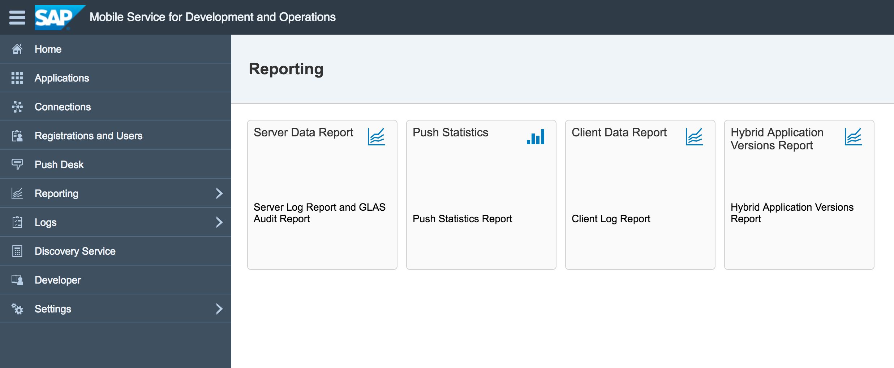
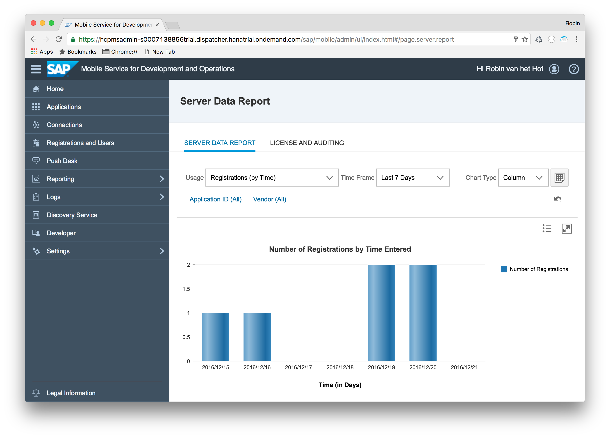
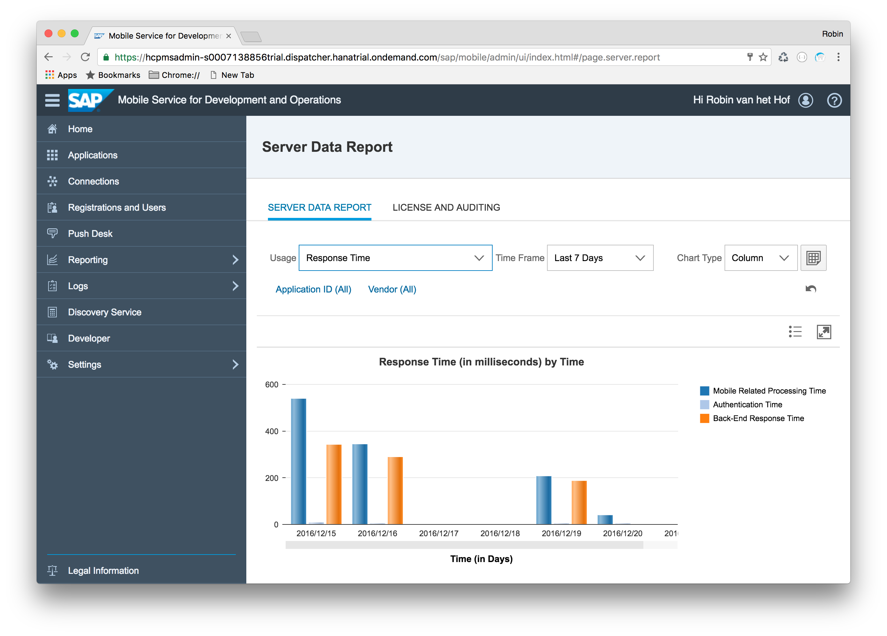
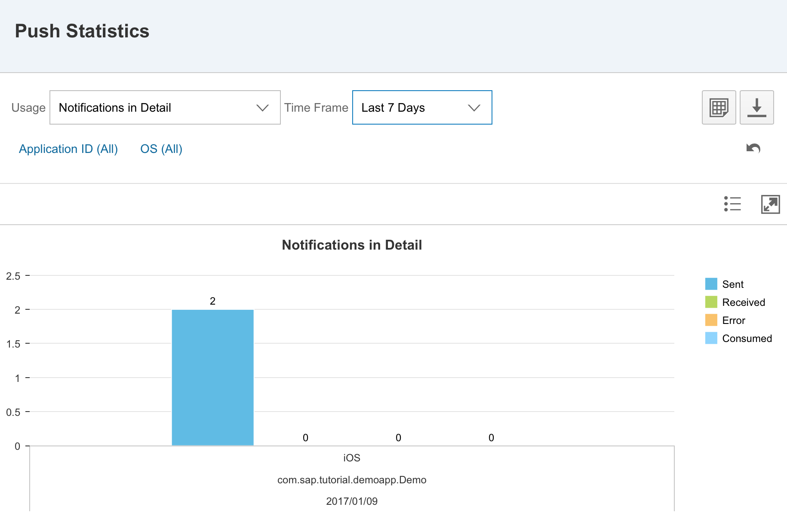

## Prerequisites  
 - **Proficiency:** Beginner
 - **Development machine:** Access to a Mac computer
 - **Tutorials:** [Logging and tracing in SAP Cloud Platform Mobile Services](https://go.sap.com/developer/tutorials/fiori-ios-hcpms-logging.html)

## Next Steps
 - [Introduction to Offline OData](https://go.sap.com/developer/tutorials/fiori-ios-hcpms-offline-odata-introduction.html)

## Details
### You will learn  
In this tutorial, learn to understand the basics of the reporting functionality in SAP Cloud Platform Mobile Services. You can view usage statistics for your iOS applications in a graphical form. You won't create or configure anything in this part, but rather get familiar of the extensive reporting possibilities.

### Time to Complete
**5 Min**.

---

[ACCORDION-BEGIN [Step 1: ](Navigate to the Reporting page)]

Go to your SAP Cloud Platform, Mobile Service for Development and Operations cockpit and log on.

Navigate to the **Reporting** page.

From here, you can access a multitude of usage statistics. In this tutorial, we will go through the most important ones.

[DONE]
[ACCORDION-END]

[ACCORDION-BEGIN [Step 2: ](Examine Server Data reports)]

Click the **Server Data Report** tile. These reports show server statistics, such as the number of registrations, type of devices registered, response times, offline requests, etc. By default, it opens with the **Registrations (by Time)** report. Change the **Time Frame** to **Last 7 Days**:

From the **Usage** drop-down box, select the **Response Time** option:

This report will give you insights in **Mobile related processing times**, **Authentication times** and **Back-End response times**. These insights can be useful to indicate certain bottlenecks in your application. In this example, you can see the mobile related processing time has decreased by refactoring certain parts of the application, resulting in an improved performance.

[DONE]
[ACCORDION-END]

[ACCORDION-BEGIN [Step 3: ](Examine Client Data reports)]

Click the **Client Data Reports** tile. At this stage of the tutorial, you won't see any statistics yet. The client data reports will only be gathered when applications have enabled collecting usage statistics -- something you haven't done yet.

[DONE]
[ACCORDION-END]

[ACCORDION-BEGIN [Step 4: ](Examine Push Statistics)]

Click the **Push Statistics** tile. Here you can review notification counts by application or OS, by time period.

> The last tile is **Hybrid Application Versions Report**. Since you're creating a native iOS application, we won't cover the significance of this tile in this tutorial.

[DONE]
[ACCORDION-END]

## Next Steps
- [Introduction to Offline OData](https://go.sap.com/developer/tutorials/fiori-ios-hcpms-offline-odata-introduction.html)
