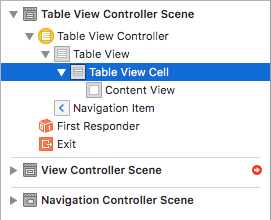
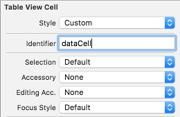
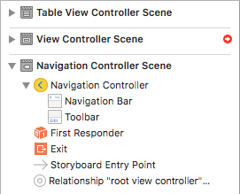
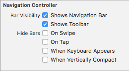
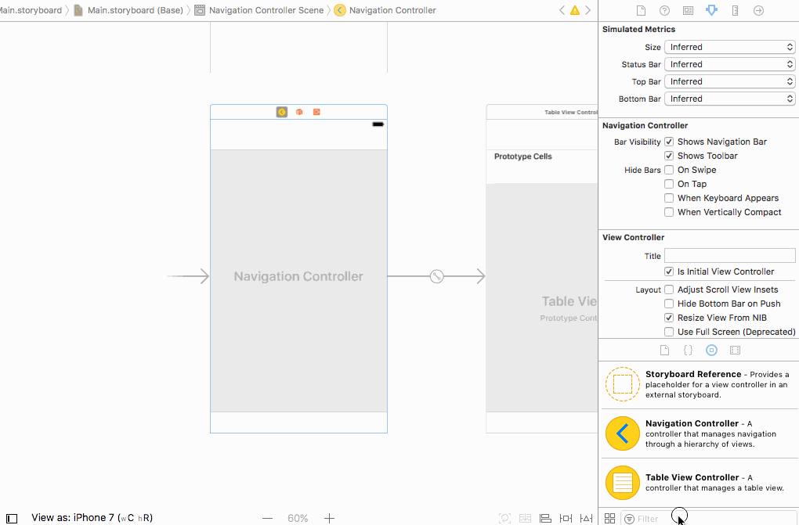
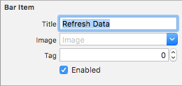
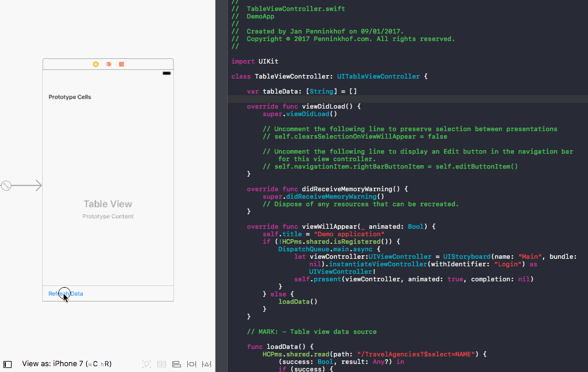
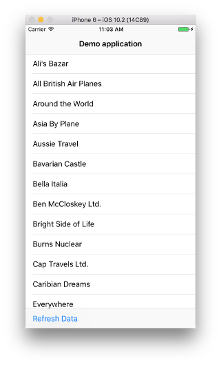

## Prerequisites  
 - [Verify whether your application has been registered](http://www.sap.com/developer/tutorials.html?fiori-ios-hcpms-verify-registration.html)

## Next Steps
 - [Translate your application using the SAP Translation Hub](http://www.sap.com/developer/tutorials.html?fiori-ios-hcpms-translation-service.html)

## Details
### You will learn  
Now the device has been properly registered in the SAP Cloud Platform Mobile Services back-end, it should be possible to reach the OData service provided by the SAP ES4 back-end. You will learn how to format your request to the SAP Cloud Platform Mobile Services and have it passed through to OData back-end that was set-up in a previous tutorial.

### Time to Complete
**15 Min**

---

[ACCORDION-BEGIN [Introduction: ](Goal)]
In the previous set of tutorials, you have setup a connection to the SAP Cloud Platform Mobile Service and and have registered your device. The device registration result in an Application Connection Identifier (`appcid`). The `appcid`, along with the user's credentials should be passed in all requests to the OData back-end services.

Not the registration is done, it it time to connect to the actual OData service, which you exposed to the SAP Cloud Platform Mobile Services in tutorial [Configure back-end connection](http://www.sap.com/developer/tutorials.html?fiori-ios-hcpms-backend-connection.html). There are multiple entities available in the ES4 OData service. In this tutorial the `TravelAgencies` entity will be read.

When data from the OData back-end connection has been retrieved, the travel agencies details will be inserted into the table displayed in the app.

[DONE]
[ACCORDION-END]

[ACCORDION-BEGIN [Step 1: ](Add a read function in the `SAPcpms` class)]

In the **Project Navigator**, click on the `SAPcpms.swift` file. This file contains quite some code already that was built in the previous tutorials. Most of the code is revolving around registration and securely storing the credentials and Application Connection ID. However, the functions that interact with the service back-end is still missing. Add the `read` function below underneath your `register` function:

```swift
func read(path: String, completion: @escaping (Bool, Any?) -> Void) {
    print("Retrieving data from: \(serviceRoot)\(path)")
    var request = URLRequest(url: URL(string: "\(serviceRoot)\(path)")!)
    request.setValue("application/json", forHTTPHeaderField: "Accept")
    let authString = createBasicAuthString()
    if (authString != nil) {
        request.setValue("Basic \(authString!)", forHTTPHeaderField: "Authorization")
    }
    request.setValue(getAppcid(), forHTTPHeaderField: "X-SMP-APPCID")
    request.httpMethod = "GET"
    let task = URLSession.shared.dataTask(with: request) { data, response, error in
        guard let data = data, error == nil else {
            completion(false, "error=\(error)" as AnyObject?)
            return
        }

        if let httpStatus = response as? HTTPURLResponse, httpStatus.statusCode != 200 {
            print("statusCode should be 200, but is \(httpStatus.statusCode)")
            switch httpStatus.statusCode {
            case 401: completion(false, "Not Authorized" as Any?)
            default: completion(false, "Unknown error occurred" as Any?)
            }
        }

        let json = try? JSONSerialization.jsonObject(with: data, options: .allowFragments)
        completion(true, json as AnyObject?)

    }
    task.resume()
}
```

This function will take two parameters.

- The first parameter is the OData path that should be read. This parameter will be appended to the service root. To retrieve a list of traveling agencies, the OData path should be `/TravelAgencies`.
- The second parameter should contain a call-back function that is called when the request was completed. In Swift terminology this is often called a `completion handler`.

The function will create a GET request to the OData service using the service root and the path provided as a parameter. It will add the `appcid` and user's credentials from the iOS keyring and then send in to the back-end service.

When the request is complete, the completion handler is called containing either and error message of the response. This allows the caller to show the result of the read request.

[DONE]
[ACCORDION-END]

[ACCORDION-BEGIN [Step 2: ](Add identifier to table cell)]

In the **Project Navigator** select the **Main storyboard**. From the Storyboard hierarchy pane, select the **Table View Cell** control from the Table View:



From the **Attributes Inspector** in the right pane, set the **Table View Cell** property **Identifier** to `dataCell`:



The identifier is used in the controller implementation to create cells according to the prototype from the Storyboard.

[DONE]
[ACCORDION-END]

[ACCORDION-BEGIN [Step 3: ](Add a variable tableData that will hold the table data)]

The data displayed in the table view should be prepared in an array. From that array, the iOS `TableView` is able to pick it up and show it.

To create this table array, click on the `TableViewController.swift` file and the **Project Navigator** and add the code below just above the `viewDidLoad` function:

```swift
var tableData: [String] = []
```

[DONE]
[ACCORDION-END]

[ACCORDION-BEGIN [Step 4: ](Link the tableData array to the TableView)]

To link the `tableData` to the `TableView` the following changes need to be made to the `TableViewController.swift` file:

- Replace `return 0` with `return 1` in function `numberOfSections`.
- Replace `return 0` with `return tableData.count` in the occurrence of function `tableView` returning an `Int`
- Implement the second occurrence of function `tableView` returning an `UITableViewCell`, which is currently commented out. Replace the generated logic with the code below:

```swift
override func tableView(_ tableView: UITableView, cellForRowAt indexPath: IndexPath) -> UITableViewCell {
    let cell = tableView.dequeueReusableCell(withIdentifier: "dataCell", for: indexPath)
    cell.textLabel?.text = tableData[indexPath.row]
    return cell
}
```

With the definition of this functions, the `TableView` will retrieve data from the `tableData` array to fill the table. However, the `tableData` array is still empty. To fill the `tableData` array, the `loadData` function should be implemented, which is described in the next step.

[DONE]
[ACCORDION-END]

[ACCORDION-BEGIN [Step 5: ](Implement function loadData in TableViewController)]

In the **Project Navigator**, click on the `TableViewController.swift` file. This will open the code behind the table view controller. This file already contains a function `loadData`, which was created in tutorial [Device Registration](http://go.sap.com/developer/tutorials.html?fiori-ios-hcpms-device-registration.html).

The purpose of the `loadData` function is to call the back-end to retrieve traveling agencies. Once the result has been received, the JSON response should be transformed into `tableData`, which is an array of Strings. In the previous step you have already connected this `tableData` array to the `TableView`.

Replace the current `loadData` function with the function below:

```swift
func loadData() {
    SAPcpms.shared.read(path: "/TravelAgencies?$select=NAME&$orderby=NAME") {
        (success: Bool, result: Any?) in
        if (success) {
            guard let root = result as? [String: Any], let d = root["d"] as? [String: Any], let results = d["results"] as? [[String: Any]] else {
                return
            }
            self.tableData = []
            for i in 0 ..< results.count {
                let record = results[i]
                if let name = record["NAME"] as? String {
                    self.tableData.append(name)
                }
            }
            DispatchQueue.main.async{
                self.tableView.reloadData()
            }
        } else {
            OperationQueue.main.addOperation {
                let msg = result as! String
                let alert = UIAlertController(title: "Error", message: msg, preferredStyle: UIAlertControllerStyle.alert)
                alert.addAction(UIAlertAction(title: "OK", style: UIAlertActionStyle.default, handler: nil))
                self.present(alert, animated: true, completion: nil)
            }
        }
    }
}
```

The `loadData` function calls the `read` function in the  `SAPcpms`. It will pass parameter `/TravelAgencies?$select=NAME&$orderby=NAME` as OData path parameter. This means that we only need attribute `NAME` of each travel agency and that the result list should be ordered by `NAME`.

The second parameter is a completion handler that is called when the response has been received.

Once the response has been received, it should be parse as a JSON response. All traveling agencies received should be iterated and the names should be collected and added to `tableData`.

Once the data is loaded in the `tableData` variable, `self.tableView.reloadData()` is called to make the new data appear in the UI.

If an error occurred while retrieving the data, the error message should be shown to the user.

[DONE]
[ACCORDION-END]

[ACCORDION-BEGIN [Step 6: ](Run the application)]

Run the app by pressing the **Build and Run** button at the top left section of the toolbar.

Dependent on the registration status of your device your will see the login screen or will see the table view. If you see the login screen, you will have to login first.

Once the table view is visible, the app will retrieve the travel agency data and will display it in the table. Make sure your application also shows the names of traveling agencies.

You application should look similar to this:


[DONE]
[ACCORDION-END]

[ACCORDION-BEGIN [Optional: ](Add a refresh button)]

Optionally add a button to your app, allowing you to refresh the table contents.

1. **Show toolbar in the Navigation View**
    In the **Project Navigator** select the **Main storyboard**. From the Storyboard hierarchy pane, select the **Navigation Controller**:

    

    From the **Attributes Inspector** in the right pane, tick the the **Shows Toolbar** property:

    

2. **Add a button to the toolbar in the Table View**
    Drag and drop a `Bar Button Item` into the **Table View**

    

    Change the label on the button by changing the **Title** to `Refresh Data`.

    

3. **Bind the refresh button**
    Open the **Assistant Editor** by clicking on the button with two circles in the top right. This should open the editor with `TableViewController.swift` open.

    Control+Click the button that has just been added and drag it to the code editor. Drop it just below the `var tableData` statement. In the Connection dialog, enter the values below:

    |Field Name     | Value                                  |
    |---------------|----------------------------------------|
    |Connection     | `Action`                               |
    |Name           | `onRefreshButtonPress`                 |
    |Type           | `UIBarButtonItem`                      |

    

4. **Implement logic for the refresh button**
    Logic to retrieve the data is already in place, it just needs to be called from the action handler. Add the `loadData` statement to the action handler, so that it looks like this:

    ```swift
    @IBAction func onRefreshButtonPress(_ sender: UIBarButtonItem) {
        loadData()
    }
    ```

5. **Run the application**
    Run the app by pressing the **Build and Run** button at the top left section of the toolbar.

    You application should look similar to this:

    

    Every time you press the refresh button in the bottom of the screen of your app, you should see the message below appear in your Xcode console when a new request is sent to the back-end:

    

[DONE]
[ACCORDION-END]

## Next Steps
- Select a tutorial from the [Tutorial Navigator](http://www.sap.com/developer/tutorial-navigator.html) or the [Tutorial Catalog](http://www.sap.com/developer/tutorials.html)
