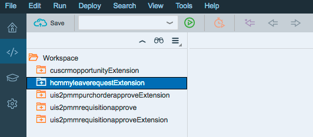
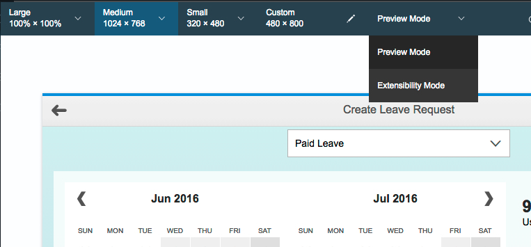
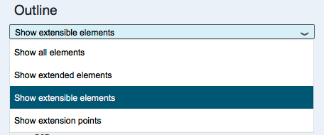
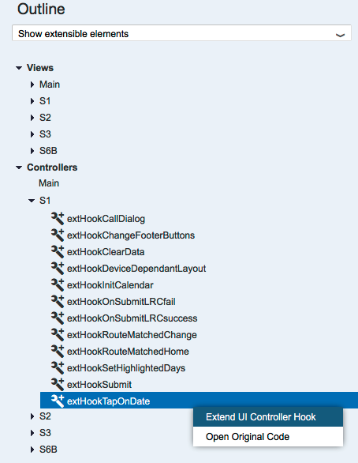
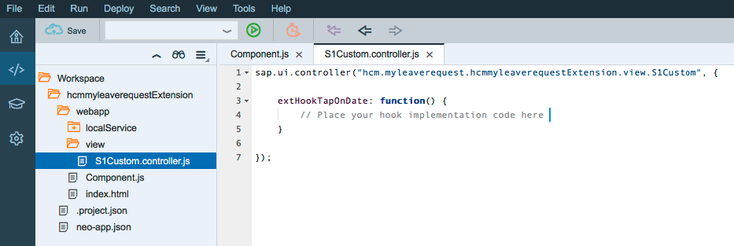
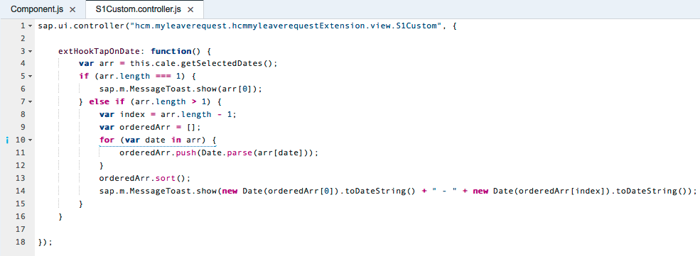
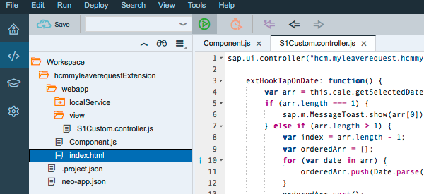
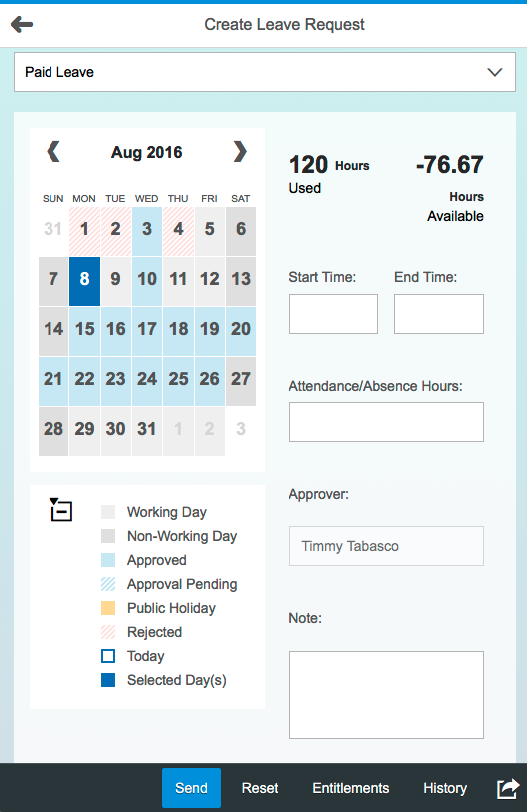

## Prerequisites  
- **Proficiency:** Beginner
- **Tutorials:** [Hide view element from a standard SAP Fiori app](http://www.sap.com/developer/tutorials/hcp-fiori-cloud-edition-hide-element.html)

## Next Steps
- [Add extended app to the SAP Fiori Launchpad](http://www.sap.com/developer/tutorials/hcp-fiori-cloud-edition-launchpad.html)

## Details
### You will learn  
In this tutorial you will learn how to extend the controller of a standard SAP Fiori app. The app that you will extended in this tutorial is "My Leave Requests". The key steps are:

- Start the extension using the extension pane in SAP Web IDE
- Locate the controller to extend
- Test the app

### Time to Complete
**10 Min**.

---


[ACCORDION-BEGIN [Step 1: ](Log into the SAP Fiori Demo Cloud Edition)]

If you've already worked through the tutorial **Hide view element from a standard SAP Fiori app** you can skip the steps 1 to 6. Please make sure that you have worked through the tutorial [Getting started with the SAP Fiori, Demo Cloud Edition](http://www.sap.com/developer/tutorials/hcp-fiori-cloud-edition-start.html). Log into the SAP Fiori Demo Cloud Edition and locate the group **Human Capital Management**. Click on the **My Leave Requests** tile.


[DONE]
[ACCORDION-END]

[ACCORDION-BEGIN [Step 2: ](Open the Standard app)]

Open the Standard app and familiarize yourself with how it appears. To start extending the app click on the gear wheel icon on the top right beside your name and choose **Develop Apps**:


[DONE]
[ACCORDION-END]

[ACCORDION-BEGIN [Step 3: ](Launch SAP Web IDE)]

You will be forwarded to a screen called "Create App Extension" where you find instructions for the next steps. Click the **Launch SAP Web IDE** button. You may have to click this button twice as the new tab may remain empty on the first attempt.


[DONE]
[ACCORDION-END]

[ACCORDION-BEGIN [Step 4: ](Log into the SAP Cloud Platform)]

You have to login to the SAP Cloud Platform. Please provide your credentials and then click **Login**.


Click **OK** to accept the project name.


The SAP Web IDE is launched with your extension project created.



[DONE]
[ACCORDION-END]

[ACCORDION-BEGIN [Step 5: ](Open the graphical extensibility pane)]

With your extension project folder selected, the graphical extensibility pane is the easiest way to preview the app and extend it. Start it via **Tools > Extensibility Pane**.


[DONE]
[ACCORDION-END]

[ACCORDION-BEGIN [Step 6: ](Switch view to extensibility mode)]

8. In order to select the view/control to extend, change from **Preview Mode** to **Extensibility Mode**.



[DONE]
[ACCORDION-END]

[ACCORDION-BEGIN [Step 7: ](Show extensible elements)]

The first step is to find the extension point for the user selecting a date. In the **Outline pane** filter for **Show extensible elements**.



[DONE]
[ACCORDION-END]

[ACCORDION-BEGIN [Step 8: ](Extend UI controller hook)]

Drill down to **Controllers > S1** and select **`extHookTapOnDate`**. Right-click on it and select **Extend UI Controller Hook**.



[DONE]
[ACCORDION-END]

[ACCORDION-BEGIN [Step 9: ](Open extension code)]

A notification that the extension code stub was generated appears. This time open the extension code directly by clicking on **Open Extension Code**.


The extension code is displayed in the Editor panel.


[DONE]
[ACCORDION-END]

[ACCORDION-BEGIN [Step 10: ](Replace comment with code)]

In **`S1Custom.controller.js`**, replace the hook implementation comment **// Place your hook implementation code here** with the code below.

```javascript
var arr = this.cale.getSelectedDates();
if (arr.length === 1) {
sap.m.MessageToast.show(arr[0]);
} else if (arr.length > 1) {
var index = arr.length - 1;
var orderedArr = [];
for (var date in arr) {
orderedArr.push(Date.parse(arr[date]));
}
orderedArr.sort();
sap.m.MessageToast.show(new Date(orderedArr[0]).toDateString() + " - " + new Date(orderedArr[index]).toDateString());
}
```

[DONE]
[ACCORDION-END]

[ACCORDION-BEGIN [Step 11: ](Beautify the code)]

Then, right-click somewhere in the white space of the editor pane and select **Beautify**.


[DONE]
[ACCORDION-END]

[ACCORDION-BEGIN [Step 12: ](Save your edits)]

**Save** your edits and again note that the asterisk ( * )  on the filename goes away after you click Save.



[DONE]
[ACCORDION-END]

[ACCORDION-BEGIN [Step 13: ](Run code to test)]

Test out your changes by selecting the **`index.html`** file and clicking the **Run** icon.



A new browser tab is opened with the application running.



[DONE]
[ACCORDION-END]

[ACCORDION-BEGIN [Step 14: ](Test with single date)]

Test it with one date, by clicking on a single day and notice the **toast** displayed at the bottom of the screen.


[DONE]
[ACCORDION-END]

[ACCORDION-BEGIN [Step 11: ](Test with date range)]

Test it with a date range by clicking on another day (the second date can be before or after the first date selected).


Congratulations, you've successfully extended a controller of a SAP Standard Fiori app.

[DONE]
[ACCORDION-END]


## Next Steps
- [Add extended app to the SAP Fiori Launchpad](http://www.sap.com/developer/tutorials/hcp-fiori-cloud-edition-launchpad.html)
