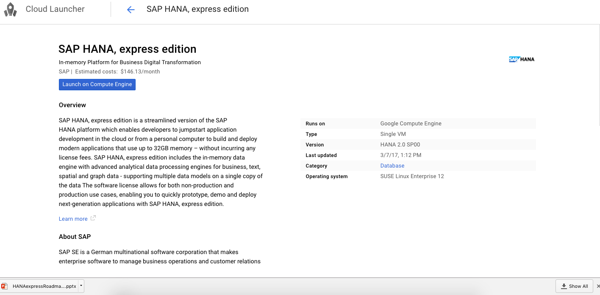
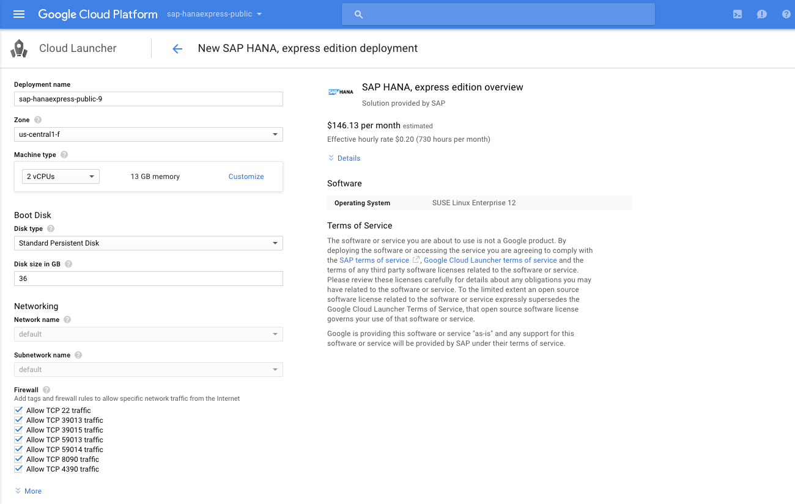
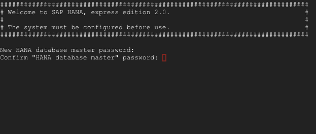
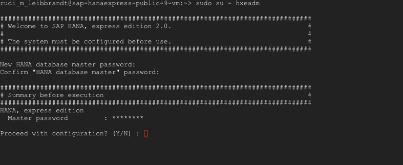
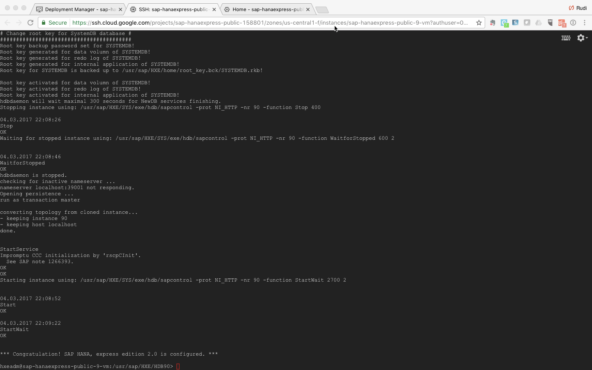

## Prerequisites  
 - **Proficiency:** Beginner
 - You have a Google Account and/or have registered for the free trial on `cloud.google.com`


## Next Steps
 - [Prepare SAP HANA, express edition for the SAP HANA Tutorial Catalog](http://www.sap.com/developer/how-tos/2016/09/hxe-howto-tutorialprep.html)
 - [Review SAP HANA, express edition content, tutorials and quick start guides](http://www.sap.com/developer/topics/sap-hana-express.html)
 - **OPTIONAL** [Setup PuTTY and WinSCP to access your SAP HANA, express edition instance on Google Cloud Platform](http://www.sap.com/developer/tutorials/hxe-gcp-setup-putty-winscp-windows.html)

## Disclaimer
The image currently only includes the HANA database engine. XS Advanced is not installed by default.

## Details
### You will learn  
This tutorial will guide you through the process to create a new Google Cloud Platform virtual instance based on SAP HANA, express edition. You will also learn how to set up your new instance and enable it for tutorials and developing your first application.

### Time to Complete
**15 Min**

---

[ACCORDION-BEGIN [Step 1: ](Create your Google Cloud Platform instance)]

Navigate to [Google Cloud Launcher](https://console.cloud.google.com/launcher) and search for SAP HANA, express edition.



Click on the **Launch on Compute Engine** button. The next page will allow you to modify the default configuration for the Cloud Virtual Machine.



Type an identifying name for the instance, then select the desired geographic zone and machine type. Individual zones might have differing computing resources available and specific access restrictions.

>The default settings for RAM, CPU and Storage are appropriate for getting familiar with SAP HANA. The recommended minimum configuration is 13GB of RAM, with at least 2 virtual CPU and 36GB of storage.

By default, the firewall rules are configured specifically for SAP HANA, express edition. As new SAP HANA applications are created, additional ports might have to be opened up. The following ports are required to connect to SAP HANA, express edition: **8090, 4390, 39013, 39015, 59013, 59014**.

To connect to the instance from a local SSH client, like PuTTY, port **22** also has to be open.

After reviewing all configuration options, click **Deploy**. This will take a few minutes.


[DONE]
[ACCORDION-END]

[ACCORDION-BEGIN [Step 2: ](Log in to the instance and change the administration passwords)]

Upon successful deployment, use the web based SSH tool and log into your instance.


Type the following command:

```
sudo su - hxeadm
```

Hit **Enter**. Follow the prompts to change password. **IMPORTANT: SAP HANA will not be usable if this step is ignored**.

>The password needs to be at least eight character-long and contain at least one digit, one uppercase and one lowercase letter. Special characters are optional. Please review password requirements in [the SAP Help](http://help-legacy.sap.com/saphelp_hanaplatform/helpdata/en/61/662e3032ad4f8dbdb5063a21a7d706/frameset.htm)



Enter `Y` to continue with configuration when prompted:


Once configuration is finished, you will see a success message:



[DONE]
[ACCORDION-END]


[ACCORDION-BEGIN [Step 3: ](Take note of your external IP and connect)]

To connect to SAP HANA, we need to know what the external IP address is. Once deployment is finished, click on the `Learn more` and follow the steps to create and external IP address.


To connect to your newly deployed instance via a local SSH client, review the documentation about [how to connect to an instance](https://cloud.google.com/compute/docs/instances/connecting-to-instance). Google Cloud Platform provides built in SSH support.

Your SAP HANA, express edition, instance is now up and running. You can now proceed to the **Next Steps** section, and continue setup.

[DONE]
[ACCORDION-END]


## Next Steps
 - [Prepare SAP HANA, express edition for the SAP HANA Tutorial Catalog](http://www.sap.com/developer/how-tos/2016/09/hxe-howto-tutorialprep.html)
 - [Review SAP HANA, express edition content, tutorials and quick start guides](http://www.sap.com/developer/topics/sap-hana-express.html)
 - **OPTIONAL** [Setup PuTTY and WinSCP to access your SAP HANA, express edition instance on Google Cloud Platform](http://www.sap.com/developer/tutorials/hxe-gcp-setup-putty-winscp-windows.html)
