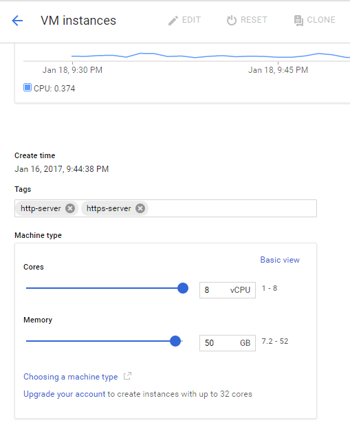
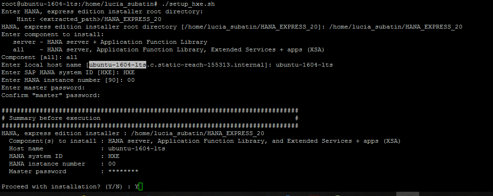
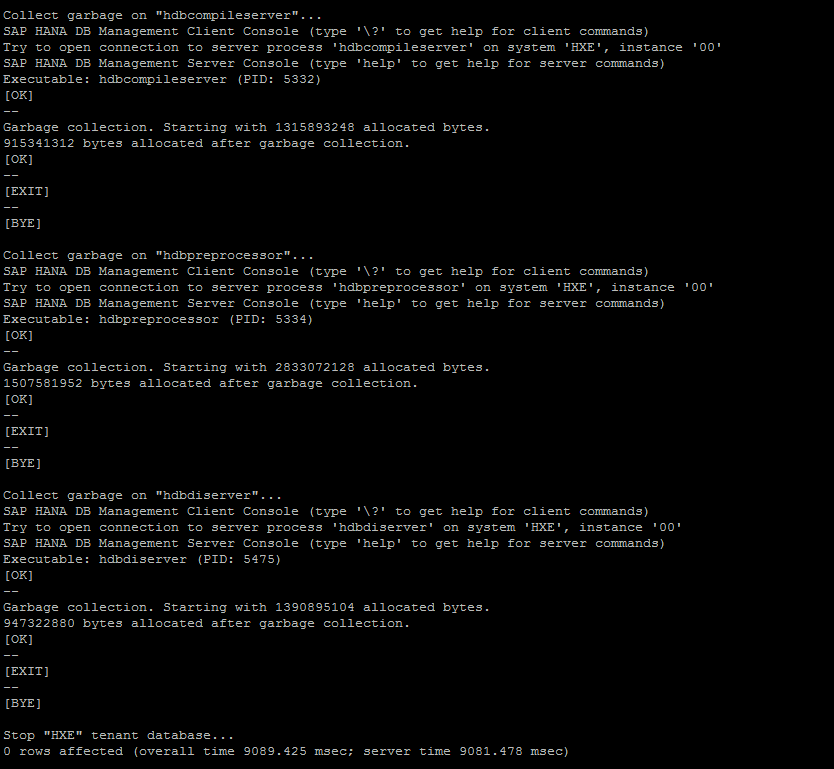
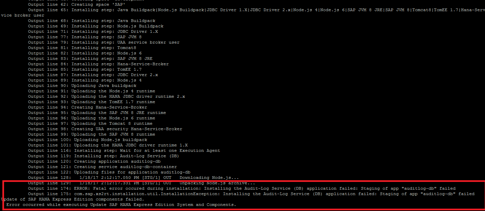

## Prerequisites  
 - [HANA Express Edition - Extract installation Files and Configure Firewall Rules](http://www.sap.com/developer/tutorials/hxe-gcp-extract-files-configure-firewall.html)


## Next Steps
 - Select a tutorial from the [Tutorial Navigator](http://www.sap.com/developer/tutorial-navigator.html) or the [Tutorial Catalog](http://www.sap.com/developer/tutorials.html)

## Disclaimer
SAP HANA, express edition (HXE) is officially supported on SLES and RHEL. SAP Community members have been successful in running HXE on other Linux operating systems that are not formally supported by SAP, such as Ubuntu, openSUSE and Fedora. SAP is not committing to resolving any issues that may arise from running HXE on these platforms.

## Details
### You will learn  
This tutorial will guide you through the final process to have your HANA Express Edition instance up and running on Google Cloud Platform.

### Time to Complete
**15 Min**

---

[ACCORDION-BEGIN [Step 1: ](Add resources to your Virtual Machine)]
You have finally got to the most important and exciting part! Go into your home directory or wherever you have extracted the installation files into.

>IMPORTANT: As this process should not be interrupted, use a separate SSH client that handles connection intermittence, instead of the web client.

You will first edit your Virtual Machine temporarily to count on more resources during installation. This will not only speed the process up but also prevent potential errors.

You will need to **Stop**  your instance before you can proceed with edition.

Double your resources for the installation process by editing the Virtual Machine from the `VM Instance` in Google Cloud Platform:



**Save** the settings and **Start** your instance again.

[DONE]
[ACCORDION-END]

[ACCORDION-BEGIN [Step 2: ](Execute the installation script)]

Log in again to the SSH client. Become `root` and go to your home directory, or into the directory where you extracted the installation packages. You will now execute the installation script:

```
sudo su –
cd /home/<<your user id>>
./setup_hxe.sh
```

The script will prompt for different parameters:

- Installer root directory


This is the directory where the files have been extracted, plus `HANA_EXPRESS_20`. If you have extracted the files in your home directory, the value to enter here is  `/home/your_home_directory/HANA_EXPRESS_20`.

Paste this value and press **Enter**.

- Components you want to install
Choose `all` to include XS Advanced tools (provided you have uploaded them) or `server` for the server-only installation:


- The hostname you setup in your `set_hostname.sh` script. In this example, `ubuntu-1604-lts`:


- System ID:
The system ID you want to use. As you will probably use the tutorials on the many things you can do in HANA Express Edition, you may want to use `HXE` as proposed:


- Enter Instance Number:
 The firewall rules have been created for instance `00`, so please update them accordingly if you choose a different instance number. Also, bear this in mind as the usual instance number used in tutorials is also `00`.

 - Master Password:
 This will be the password for administrator users such as SYSTEM or <SID>ADM.  You will definitely need to remember this password.

 

 > If you are installing the Applications package, this password is also used for the `XSA_ADMIN`, `XSA_DEV`, and `XSA_SHINE` users.

 Hit **Enter**. The best is about to come.

[DONE]
[ACCORDION-END]


[ACCORDION-BEGIN [Step 3: ](Let the installation begin)]

Review the Installation summary and hit *Y*. This is an example for an installation including XS Advanced tools:



After you hit  **Enter** the script will verbosely inform what it is doing. **Avoid disconnecting the terminal or interrupting the execution.**

Wait until the command prompt in the console is available for input again.

[DONE]
[ACCORDION-END]

[ACCORDION-BEGIN [Step 4: ](Check the installation)]

Once the installation finishes, you can scroll up and see if there are any visible errors in the console log.



You can also check the log by running command `ls -ltr` in the directory
`/var/tmp` and open the latest installation log file using commands such as `more <name of the file>` or `cat <name of the file>`. The following is an example of an error aborting the installation:



Finally, the command-line Lifecycle Management program can check the installation for you: `/hana/shared/HXE/hdblcm/hdblcm`.

[DONE]
[ACCORDION-END]

[ACCORDION-BEGIN [Step 5: ](Reset the resources for your Virtual Machine)]

Switch to the `<sid>adm` user. If your System ID is `HXE`, the user will be `hxeadm`. Stop the database using program `HDB` from the administrator´s home directory:

```
 su hxeadm
 ./HDB Stop
```

>Hint: You can start the database again with command `./HDB start` and check if the services are running with `./HDB info`

Once the Database is stopped, stop the Virtual Machine too from Google Cloud platform's console.

Edit the Virtual Machine to suit your installation. These are the minimal requirements and it is recommended that you monitor resources to adjust them as needed. The Google Cloud Platform will also hint you on resource utilization.

- Server Only:
  a. CPU: 4 cores
  b. RAM: 16 GB RAM

- Server + XS Application
  a. CPU: 4 cores
  b. RAM: 24 GB RAM

> Remember: SAP HANA Express Edition license is free up to 32 GB of RAM.

**Save** your settings.

[DONE]
[ACCORDION-END]


[ACCORDION-BEGIN [Step 5: ](Set the host name)]

Remember to set you hosts file in your local computer with the pair <<external IP from Gcloud>>  <<host name>>. You will generally fins these files in folders `/etc/hosts` or in `C:\Windows\System32\drivers\etc`, and the configuration would look like the following example:


Where the  `104.109.XXX.XXX` stands for the external IP and the `ubuntu-1604-lts` value stands for the name of the host that you have set up in the server.

Enjoy your HANA Express Edition Instance!

[DONE]
[ACCORDION-END]


---

## Next Steps
- Select a tutorial from the [Tutorial Navigator](http://www.sap.com/developer/tutorial-navigator.html) or the [Tutorial Catalog](http://www.sap.com/developer/tutorials.html)
