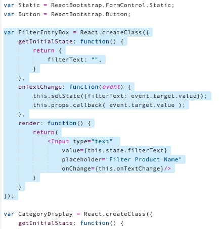
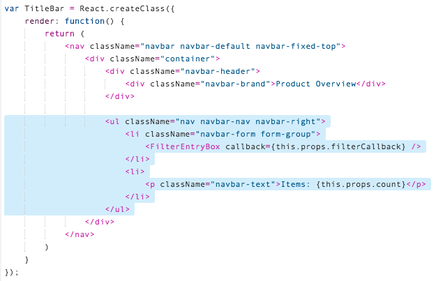
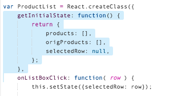
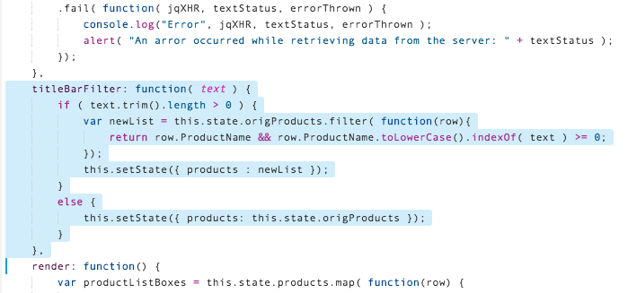

## Prerequisites  
- **Proficiency:** Beginner
- **Tutorial:** [Create child components](http://www.sap.com/developer/tutorials/react-child-components.html)

## Next Steps
- This is the end of the tutorial series.  [Return to the tutorial navigator.](http://www.sap.com/developer/tutorial-navigator.html)


## Details
### You will learn  
In this tutorial series, we will explore another technology for Single Page Application (SPA) development - React.  React is another popular web framework, and is used by many companies for both internal and client-facing systems.  These tutorials will parallel our SAPUI5 tutorials, building a visual interface using Angular, and connecting it to an OData back end service.

### Time to Complete
**20 Min**.

---

#### REACT tutorial series
**Step 9**: One important detail of REACT is how to communicate from one component to another.  Communicating from parent to child is easy.  A parent sends a child properties (or `props`) and the child receives these read-only variables.  Communication from the child to the parent is a little harder, but has a lot of value.

This tutorial will set up a new component to filter the list of products.  The new component, a filter entry box, will then communicate back to the parent so that the parent can take action on the list.


---

[ACCORDION-BEGIN [Step 1: ](Add filter component)] 

First, create a new component for the Filter input box.  This box will hold the filter entry and then send the text back to the callback function.

Open the `main.js` file, and add the following new JavaScript code to the top of the file (under the variable declarations):

```javascript
var FilterEntryBox = React.createClass({
getInitialState: function() {
	return {
		filterText: "",
	}
},
onTextChange: function(event) {
	this.setState({filterText: event.target.value});
	this.props.callback( event.target.value );
},
render: function() {
	return(
		<Input type="text"
			value={this.state.filterText}
			placeholder="Filter Product Name"
			onChange={this.onTextChange}/>
	)
}
});
```




[DONE]
[ACCORDION-END]

[ACCORDION-BEGIN [Step 2: ](Add filter input box)] 

The next step is to add this filter input box to the title bar.  

Adding a component to the side of the title bar will require a change to the Bootstrap layout.  A single component can be put on either side (left or right).  But multiple components need to be set up as an unordered list (`<ul>`) so that they are rendered in the proper order.  

To do this, scroll down to the `TitleBar` component.  **Replace** the existing `<div className="nav navbar-nav navbar-right">` section with this new JMX code:

```javascript
<ul className="nav navbar-nav navbar-right">
<li className="navbar-form form-group">
	<FilterEntryBox callback={this.props.filterCallback} />
</li>
<li>
	<p className="navbar-text">Items: {this.props.count}</p>
</li>
</ul>
```



[DONE]
[ACCORDION-END]

[ACCORDION-BEGIN [Step 3: ](Update the ProductList component)] 

The last step is to update the `ProductList` component.  This component owns the list of products, so the actual work of filtering will occur here.  

There are three changes required.  First, add a variable to the initial state, to hold the original unfiltered list.

Scroll down to the `ProductList` component, and replace the `getInitialState:` section with the following code:

```javascript
getInitialState: function() {
  return {
  	products: [],
  	origProducts: [],
  	selectedRow: null,
  };
},
```



[DONE]
[ACCORDION-END]

[ACCORDION-BEGIN [Step 4: ](Add callback method for filter text)] 

The second change to `ProductList` is to add a callback method for the filter text.  This method will receive the user-entered filter text, and will then filter the display list.  When this method sets the new filtered list in the state, the component will re-render the entire list automatically.

Add the following new JavaScript to the `ProductList` component, under the `componentDidMount` section:

```javascript
titleBarFilter: function( text ) {
if ( text.trim().length > 0 ) {
	var newList = this.state.origProducts.filter( function(row){
		return row.ProductName && row.ProductName.toLowerCase().indexOf( text ) >= 0;
	});
	this.setState({ products : newList });
}
else {
	this.setState({ products: this.state.origProducts });
}
},
```



[DONE]
[ACCORDION-END]

[ACCORDION-BEGIN [Step 5: ](Send the callback)] 

The third change to `ProductList` is to send the callback to the `<TitleBar>` component.  

Scroll down to the `render:` method, and **replace** the `<TitleBar>` component with this new JMX:

```javascript
<TitleBar count={this.state.products.length} filterCallback={this.titleBarFilter}/>
```


[DONE]
[ACCORDION-END]

[ACCORDION-BEGIN [Step 6: ](Run the application)] 

Run the application.  Enter some text in the new filter input in the title bar, and the list will filter automatically.


[DONE]
[ACCORDION-END]

[ACCORDION-BEGIN [Step 7: ](Review parent-child communication)] 

React has a tutorial page that [discusses parent-child communication](https://facebook.github.io/react/docs/components-and-props.html).  

[DONE]
[ACCORDION-END]

[ACCORDION-BEGIN [Step 8: ](Review final code)] 

The `main.js` file is the only one modified.  It has become quite complex.  Here is the final copy of that file:

```javascript
var FormGroup = ReactBootstrap.FormGroup;
var Label = ReactBootstrap.ControlLabel;
var Input = ReactBootstrap.FormControl;
var Static = ReactBootstrap.FormControl.Static;
var Button = ReactBootstrap.Button;

var FilterEntryBox = React.createClass({
getInitialState: function() {
return {
filterText: "",
}
},
onTextChange: function(event) {
this.setState({filterText: event.target.value});
this.props.callback( event.target.value );
},
render: function() {
return(
<Input type="text"
	value={this.state.filterText}
	placeholder="Filter Product Name"
	onChange={this.onTextChange}/>
)
}
});

var CategoryDisplay = React.createClass({
getInitialState: function() {
return {
categoryCache: [],
loaded: false,
};
},
componentDidMount: function() {
var odataUrl = "/Northwind/V3/Northwind/Northwind.svc/";

$.ajax({
url: odataUrl + "Categories" ,
dataType: 'json',
cache: false
})
.done( function( data, textStatus, jqXHR ) {
	this.setState( {
		categoryCache: data.value,
		loaded: true,
	} );
}.bind(this)
)
.fail( function( jqXHR, textStatus, errorThrown ) {
console.log("Error", jqXHR, textStatus, errorThrown );
alert( "An arror occurred while retrieving the category list from the server: " + textStatus );
});
},
findRow: function( id ) {
var result = $.grep(this.state.categoryCache, function(e){ return e.CategoryID == id; });
if ( result.length > 0 ) return result[0].CategoryName;
else return null;
},
render: function() {
return(
<span>
	{ this.state.loaded ? this.findRow( this.props.id ) : "...loading..." }
</span>
)
}
})

var AvailableDisplay = React.createClass({
render: function() {
return(
<span className={this.props.value ? "discontinued" : "available"}>
	{this.props.value ? "Discontinued" : "Available"}
</span>
)
}
});

var CurrencyDisplay = React.createClass({
render: function() {
var computedPrice = new Number( this.props.value );
computedPrice = Math.round( computedPrice * 100 )/100;
computedPrice = computedPrice.toFixed(2).toLocaleString();

return(
<span>
	{computedPrice}
	<small className="text-muted"> EUR</small>
</span>
)
}
});

var ModalProductDetail = React.createClass({
getInitialState: function() {
return {
OrderCount: "",
orderSubmitted: false,
}
},
onOrderChange: function(event) {
this.setState({OrderCount: event.target.value});
},
onSaveClick: function() {
this.setState({
orderSubmitted: true,
});

setTimeout( this.closeAndReset, 2000 );
},
closeAndReset: function() {
$('#product-detail').modal('hide');
this.setState({
orderSubmitted: false,
OrderCount: "",
});
},
render: function() {
return (
<div className="modal fade" tabIndex="-1" role="dialog" id="product-detail">
	<div className="modal-dialog modal-lg" role="document">
		<div className="modal-content">
			<div className="modal-header">
				<h4 className="modal-title">Product Details - {this.props.row.ProductName}</h4>
			</div>
			<div className="modal-body">
				{ this.state.orderSubmitted ? <div className="alert alert-success" role="alert">
					<strong>Success!</strong>&nbsp;
					{this.state.OrderCount} units of {this.props.row.ProductName} have been ordered.
				</div> : null }
				<form className="form-horizontal">
					<FormGroup>
						<Label className="col-sm-3">Product Name</Label>
						<Static className="col-sm-9">{this.props.row.ProductName}</Static>
					</FormGroup>
					<FormGroup>
						<Label className="col-sm-3">Unit Price</Label>
						<Static className="col-sm-9">
							<CurrencyDisplay value={this.props.row.UnitPrice} />
						</Static>
					</FormGroup>
					<FormGroup>
						<Label className="col-sm-3">Status</Label>
						<Static className="col-sm-9">
							<AvailableDisplay value={this.props.row.Discontinued} />
						</Static>
					</FormGroup>
					<FormGroup>
						<Label className="col-sm-3">Category</Label>
						<Static className="col-sm-9">
							<CategoryDisplay id={this.props.row.CategoryID} />
						</Static>
					</FormGroup>
					<FormGroup>
						<Label className="col-sm-3">Units In Stock</Label>
						<Static className="col-sm-9">{this.props.row.UnitsInStock}</Static>
					</FormGroup>
					<FormGroup>
						<Label className="col-sm-3">Order Amount</Label>
						<div className="col-sm-6">
							<Input type="number"
									value={this.state.OrderCount}
									placeholder="Number of units to order"
									onChange={this.onOrderChange}
									disabled={this.state.orderSubmitted}/>
						</div>
					</FormGroup>
				</form>
			</div>
			<div className="modal-footer">
				<Button bsStyle="primary" onClick={this.onSaveClick}
					disabled={this.state.OrderCount == "" || this.state.orderSubmitted}>Save</Button>
				<Button onClick={this.closeAndReset}>Close</Button>
			</div>
		</div>
	</div>
</div>
)
}
});

var TitleBar = React.createClass({
render: function() {
return (
<nav className="navbar navbar-default navbar-fixed-top">
	<div className="container">
		<div className="navbar-header">
			<div className="navbar-brand">Product Overview</div>
		</div>

		<ul className="nav navbar-nav navbar-right">
  				<li className="navbar-form form-group">
  					<FilterEntryBox callback={this.props.filterCallback} />
  				</li>
  				<li>
  					<p className="navbar-text">Items: {this.props.count}</p>
  				</li>
  			</ul>
	</div>
</nav>
)
}
});

var ListBox = React.createClass({
render: function() {
  return (
<button type="button" className="list-group-item" id="product-list"
		onClick={this.props.clickEvent} >
	<div className="row vertical-align">
		<div className="col-sm-8 top">
			<h4>{this.props.row.ProductName}</h4>
			<p> {this.props.row.QuantityPerUnit}</p>
		</div>
		<div className="col-sm-3 text-right top">
			<h4>
				<CurrencyDisplay value={this.props.row.UnitPrice} />
			</h4>
			<AvailableDisplay value={this.props.row.Discontinued} />
		</div>
		<div className="col-sm-1 center">
			<span className="glyphicon glyphicon-chevron-right pull-right" aria-hidden="true"></span>
		</div>
	</div>
</button>
);
}
});

var ProductList = React.createClass({
getInitialState: function() {
return {
products: [],
origProducts: [],
selectedRow: null,
};
},
onListBoxClick: function( row ) {
this.setState({selectedRow: row});

setTimeout( function() {
$('#product-detail').modal("show");
});
},
componentDidMount: function() {
var odataUrl = "/Northwind/V3/Northwind/Northwind.svc/";

$.ajax({
url: odataUrl + "Products" ,
dataType: 'json',
cache: false
})
.done( function( data, textStatus, jqXHR ) {
	this.setState( {
		products: data.value,
		origProducts: data.value,
	} )
}.bind(this)
)
.fail( function( jqXHR, textStatus, errorThrown ) {
console.log("Error", jqXHR, textStatus, errorThrown );
alert( "An arror occurred while retrieving data from the server: " + textStatus );
});
},
titleBarFilter: function( text ) {
if ( text.trim().length > 0 ) {
var newList = this.state.origProducts.filter( function(row){
	return row.ProductName && row.ProductName.toLowerCase().indexOf( text ) >= 0;
});
this.setState({ products : newList });
}
else {
this.setState({ products: this.state.origProducts });
}
},
render: function() {
var productListBoxes = this.state.products.map( function(row) {
return(
	<ListBox row={row} key={row.ProductName}
		clickEvent={this.onListBoxClick.bind(this, row)}/>		
);
}.bind(this) )

return (
<div>
	<TitleBar count={this.state.products.length} filterCallback={this.titleBarFilter}/>
	<div className="list-group">
		{productListBoxes}
	</div>
	{this.state.selectedRow == null ? null :
		<ModalProductDetail row={this.state.selectedRow} /> }
</div>
)
}
});

ReactDOM.render(
<ProductList />,
document.getElementById('product-list')
);
```

[DONE]
[ACCORDION-END]


---

## Next Steps
- [Return to the tutorial navigator.](http://www.sap.com/developer/tutorial-navigator.html)
