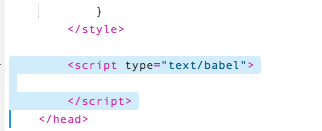
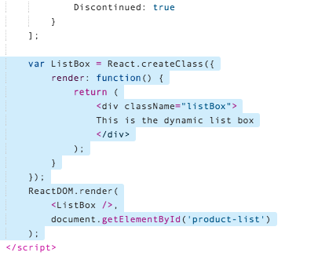
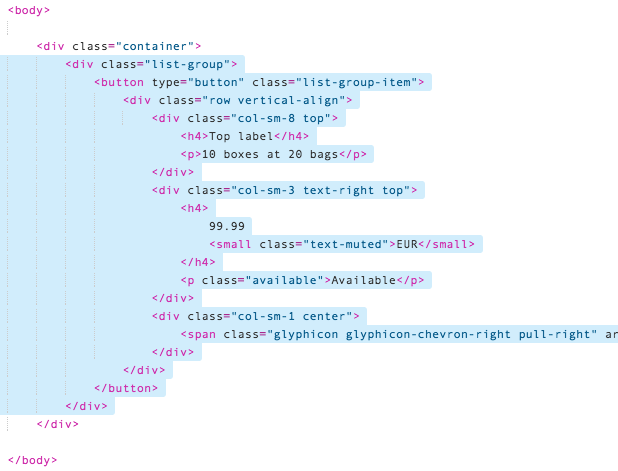
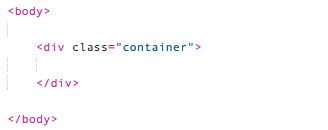
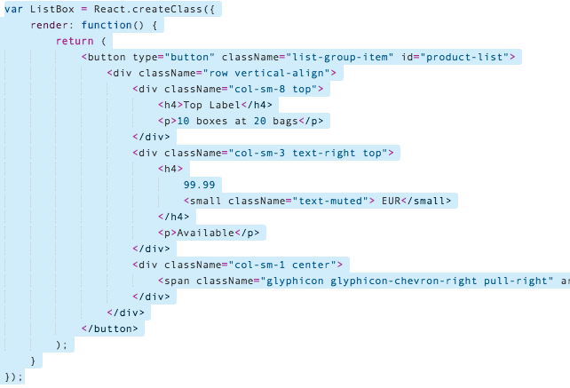
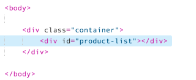

## Prerequisites  
- **Proficiency:** Beginner
- **Tutorial:** [Define the Bootstrap Template](http://www.sap.com/developer/tutorials/react-bootstrap-template.html)

## Next Steps
- **Tutorial:** [Separate the files](http://www.sap.com/developer/tutorials/react-separate-files.html)


## Details
### You will learn  
In this tutorial series, we will explore another technology for Single Page Application (SPA) development - React.  React is another popular web framework, and is used by many companies for both internal and client-facing systems.  These tutorials will parallel our SAPUI5 tutorials, building a visual interface using Angular, and connecting it to an OData back end service.

### Time to Complete
**15 Min**.

---

#### REACT tutorial series
**Step 3**: Add the React JavaScript code to the web application.   This step will take the existing bootstrap template, which defined the layout of the page, and start to move that HTML in to React components.  The React components are written in JavaScript, and use JMX as a template for the HTML fragments they replace.

This will involve the following steps:

1.  Add the React JavaScript libraries
2.  Set up the React framework
3.  Create our first component
4.  Create a second component, to be the parent of the first component

---

[ACCORDION-BEGIN [Step 1: ](Add the React JavaScript libraries)] 

Open the Web IDE, and then open your `index.html` page.

First, we need to add Angular to our application.  Add the following to the `<head>` section of your HTML page:

```html
<script src="https://unpkg.com/react@15.3.2/dist/react.js"></script>
<script src="https://unpkg.com/react-dom@15.3.2/dist/react-dom.js"></script>
<script src="https://cdnjs.cloudflare.com/ajax/libs/react-bootstrap/0.30.5/react-bootstrap.js"></script>
<script src="https://unpkg.com/babel-standalone@6.15.0/babel.min.js"></script>
```


[DONE]
[ACCORDION-END]

[ACCORDION-BEGIN [Step 2: ](Add character encoding)] 

Next, add the following tag to the `<head>` of your document:

```html
<meta charset="utf-8">
```

> **Why?**  
>
> The previous HTML standard (HTML 4) specified the `ISO-8859-1` character set as the default.  When HTML5 was released, the specification was updated to default to UTF-8.  UTF-8 is a much more flexible character set, and can support languages from all over the world.
>
> The React framework defaults to reading `ISO-8859-1` characters.  So, if we don't tell it to use UTF-8 (which is what SAP Cloud Platform uses), React will not understand the characters and will throw several syntax errors.
>
> The tag `<meta charset="">` is now the recommended best practice in all HTML.


[DONE]
[ACCORDION-END]

[ACCORDION-BEGIN [Step 3: ](Add JavaScript to page)] 

Next, we will create a JavaScript section to define our application.  In this example, we will put the code in our `index.html` file, for convenience.  Later, we will move this over to a separate file, which is the standard convention for working with large JavaScript applications.


Add a `<script>` element to the end of your `<head>` section.  Add the following code:

>**WARNING** The placement of this script element is critical!  The script must be **after** the "import" of your React code.

```html
<script type="text/babel">

</script>
```



[DONE]
[ACCORDION-END]

[ACCORDION-BEGIN [Step 4: ](Add skeleton for component)] 

Next, we will add our first React component.

> React is all about building components in JavaScript, and then inserting those components directly in to the HTML.  A React component is both HTML and the JavaScript code that makes it work.  Both pieces (the HTML and the JavaScript) are stored in a single location.
>
> React was built to solve a issue called [Separation of Concerns](https://en.wikipedia.org/wiki/Separation_of_concerns).  Both the structure of the component and the logic of the component are in the same place.  This allows you, the developer, to clearly see how the two interact and control both parts from a single location.
>
> React is a lot like SAPUI5.  In React, code is the center of the work, and HTML is built in to the code.  This makes both SAPUP5 and React "code centric".  
>
> This may not be very clear at the moment, but as you follow the tutorials, you will notice the differences.


Add the following code to the bottom of your `<script>` tag:

```javascript
var ListBox = React.createClass({
  render: function() {
      return (
          <div className="listBox">
          This is the dynamic list box
          </div>
      );
  }
});
ReactDOM.render(
  <ListBox />,
  document.getElementById('product-list')
);
```



[DONE]
[ACCORDION-END]

[ACCORDION-BEGIN [Step 5: ](Run the app)] 

Run the application.  Nothing looks different, yet, because we haven't attached the data to the HTML.  That happens next.


[DONE]
[ACCORDION-END]

[ACCORDION-BEGIN [Step 6: ](Add your first React component)] 

React is component based.  Each dynamic element on the screen becomes a React component.  Our first goal is to take our existing Bootstrap design (from the previous tutorial) and turn it in to a React component.  

We will start by removing the existing HTML, and move it to the React framework

Go to your `index.html` file, select the following HTML code, and **delete** it.

```html
<div class="list-group">
<button type="button" class="list-group-item">
	<div class="row vertical-align">
		<div class="col-sm-8 top">
	    	<h4>Top label</h4>
	    	<p>10 boxes at 20 bags</p>
	    </div>
	    <div class="col-sm-3 text-right top">
	    	<h4>
	    		99.99
	    		<small class="text-muted">EUR</small>
	    	</h4>
	    	<p class="available">Available</p>
	    </div>
	    <div class="col-sm-1 center">
	        <span class="glyphicon glyphicon-chevron-right pull-right" aria-hidden="true"></span>
	    </div>
    </div>
</button>
</div>
```



The HTML portion should now look like this:



[DONE]
[ACCORDION-END]

[ACCORDION-BEGIN [Step 7: ](Create new component)] 

Create a new React component.  Scroll up to the `<script type="text/babel">` tag, and add the following code to the **top** of your existing JavaScript

```javascript
var ListBox = React.createClass({
  render: function() {
      return (
		<button type="button" className="list-group-item">
			<div className="row vertical-align">
				<div className="col-sm-8 top">
					<h4>Top Label</h4>
					<p>10 boxes at 20 bags</p>
				</div>
				<div className="col-sm-3 text-right top">
					<h4>
						99.99
						<small className="text-muted"> EUR</small>
					</h4>
					<p>Available</p>
				</div>
				<div className="col-sm-1 center">
					<span className="glyphicon glyphicon-chevron-right pull-right" aria-hidden="true"></span>
				</div>
			</div>
		</button>
	);
  }
});
```



[DONE]
[ACCORDION-END]

[ACCORDION-BEGIN [Step 8: ](Add div for component)] 

In order to render the new React code, the browser requires a small piece of HTML telling it where to put the new React component.

Scroll down to the `<body>` tag, and add the following HTML inside the `<div class="container">` tag:

```html
<div id="product-list"></div>
```



[DONE]
[ACCORDION-END]

[ACCORDION-BEGIN [Step 9: ](Run your application)] 

Run your application.  The output should look exactly the same, even though the code has moved around.  This means that React is now displaying the component, using the same format we used in our static Bootstrap layout.


[DONE]
[ACCORDION-END]

[ACCORDION-BEGIN [Step 10: ](Add a list-group)] 


The first React component is a single list element.  In order to have multiple list elements, the next component will be a container that holds multiple list items.

In Bootstrap, this is called a `list-group`.  Our new component will hold a list group, and place the list items inside of itself.  In React terms, this is called component [Children](https://facebook.github.io/react/docs/multiple-components.html#children).

Open your `index.html` file, and scroll to the `<script>` tag in the top of the document.

Add the following JavaScript in between your existing `ListBox` component, and the `ReactDOM.render` call at the end.

```javascript
var ProductList = React.createClass({
render: function() {
	return (
		<div className="list-group">
			<ListBox />
			<ListBox />
			<ListBox />
		</div>
	)
}
});
```

[DONE]
[ACCORDION-END]

[ACCORDION-BEGIN [Step 11: ](Replace ListBox tag)] 

Move down slightly.  In the `ReactDOM.render` call, **replace** the line `<ListBox />,` with the following new JavaScript code:

```javascript
<ProductList />,
```

[DONE]
[ACCORDION-END]

[ACCORDION-BEGIN [Step 12: ](Run the application)] 

Run the application.  You will see three copies of the same row displayed.  (This is because the row data is still static.  We will change this later.)

[DONE]
[ACCORDION-END]

[ACCORDION-BEGIN [Step 13: ](Review final code)] 

For your reference, your `index.html` file should now look like this:

```html
<!DOCTYPE HTML>
<html lang="en">
<head>
<meta charset="utf-8">

<script src="https://code.jquery.com/jquery-3.1.0.min.js"
integrity="sha256-cCueBR6CsyA4/9szpPfrX3s49M9vUU5BgtiJj06wt/s="
crossorigin="anonymous"></script>

<link href="https://maxcdn.bootstrapcdn.com/bootstrap/3.3.7/css/bootstrap.min.css"
rel="stylesheet"
integrity="sha384-BVYiiSIFeK1dGmJRAkycuHAHRg32OmUcww7on3RYdg4Va+PmSTsz/K68vbdEjh4u"
crossorigin="anonymous">
<script src="https://maxcdn.bootstrapcdn.com/bootstrap/3.3.7/js/bootstrap.min.js"
integrity="sha384-Tc5IQib027qvyjSMfHjOMaLkfuWVxZxUPnCJA7l2mCWNIpG9mGCD8wGNIcPD7Txa"
crossorigin="anonymous"></script>

<script src="https://unpkg.com/react@15.3.2/dist/react.js"></script>
<script src="https://unpkg.com/react-dom@15.3.2/dist/react-dom.js"></script>
<script src="https://cdnjs.cloudflare.com/ajax/libs/react-bootstrap/0.30.5/react-bootstrap.js"></script>
<script src="https://unpkg.com/babel-standalone@6.15.0/babel.min.js"></script>

<style>
	.vertical-align {
		display: flex;
		align-items: baseline;
	}

	.vertical-align .top {
		align-self: baseline;
	}

	.vertical-align .center {
		align-self: center;
	}

	.available {
  	color: green;
  	font-weight: bold;
  }

  .discontinued {
  	color: red;
  	font-weight: bold;
  }
</style>

<script type="text/babel">

var ListBox = React.createClass({
    render: function() {
        return (
			<button type="button" className="list-group-item" id="product-list">
				<div className="row vertical-align">
					<div className="col-sm-8 top">
						<h4>Top Label</h4>
						<p>10 boxes at 20 bags</p>
					</div>
					<div className="col-sm-3 text-right top">
						<h4>
							99.99
							<small className="text-muted"> EUR</small>
						</h4>
						<p>Available</p>
					</div>
					<div className="col-sm-1 center">
						<span className="glyphicon glyphicon-chevron-right pull-right" aria-hidden="true"></span>
					</div>
				</div>
			</button>
		);
    }
});

var ProductList = React.createClass({
	render: function() {
		return (
			<div className="list-group">
				<ListBox />
				<ListBox />
				<ListBox />
			</div>
		)
	}
});

ReactDOM.render(
    <ProductList />,
    document.getElementById('product-list')
);

</script>
</head>

<body>

<div class="container">
<div id="product-list"></div>
</div>

</body>
</html>
```

[DONE]
[ACCORDION-END]

[ACCORDION-BEGIN [Step 14: ](Review additional resources)] 

React:

- [React getting started tutorial, from the official website](https://facebook.github.io/react/docs/tutorial.html)
- We also use [children components](https://facebook.github.io/react/docs/multiple-components.html#children) for the first time.

Bootstrap:

- We make extensive use of lists in our tutorial.  [Bootstrap CSS - list groups](https://getbootstrap.com/components/#list-group)

[DONE]
[ACCORDION-END]


## Next Steps
- **Tutorial:** [Separate the files](http://www.sap.com/developer/tutorials/react-separate-files.html)
