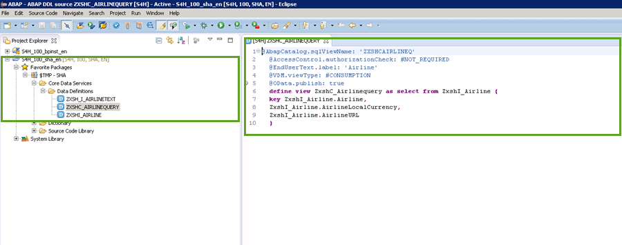
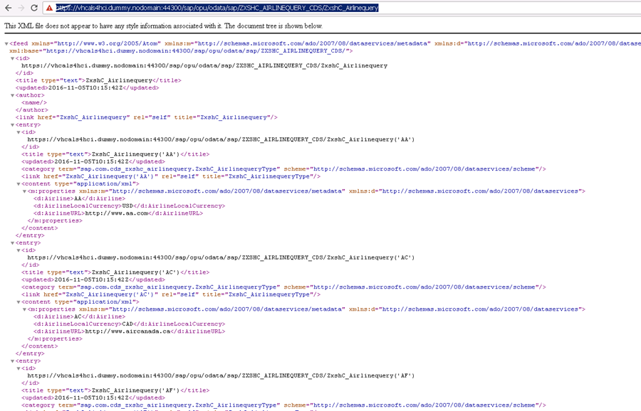
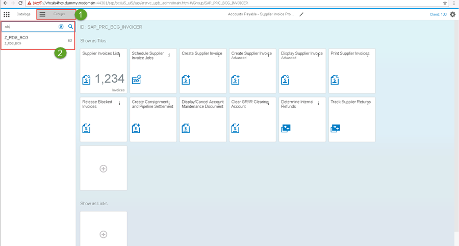
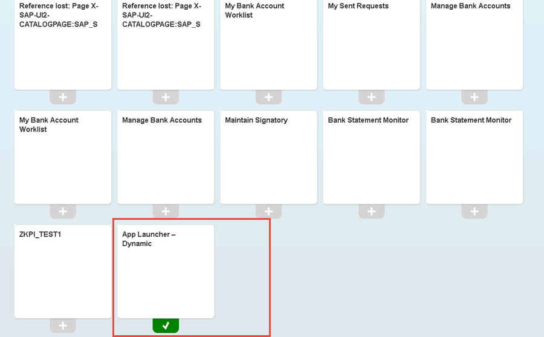
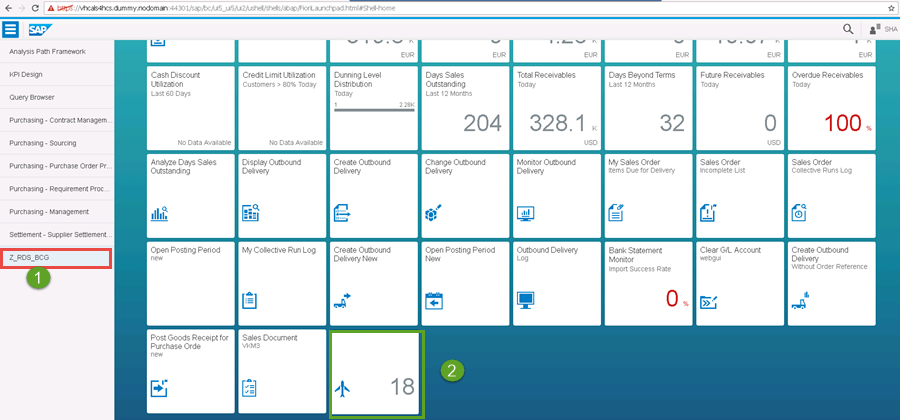

## Prerequisites  
 - **Proficiency:** Intermediate
 - **Tutorials:** [Creating simple tiles within Fiori Launchpad](http://sap.com/developer/tutorials/s4hana-cds-launchpad-designer-fiori-role.html)

## Next Steps
 - Select a tutorial from the [Tutorial Navigator](http://sap.com/developer/tutorial-navigator.html) or the [Tutorial Catalog](http://sap.com/developer/tutorials.html)

## Details
### You will learn  
How to create a tile within Fiori Launchpad.

### Time to Complete
**15-20 Min**

---

[ACCORDION-BEGIN [Step 1: ](Start the Fiori Launchpad Designer)]

The tile to build will be added to the group `Z_RDBC_BCG`

To achieve that you need to log in to Fiori Launchpad Designer as shown in the [previous tutorial](http://sap.com/developer/tutorials/s4hana-cds-launchpad-designer-fiori-role.html) and extend the URL with: `sap/bc/ui5_ui5/sap/arsrvc_upb_admn/main.html/`

[DONE]
[ACCORDION-END]

[ACCORDION-BEGIN [Step 2: ](Create a new tile)]

In the Launchpad Designer you have two items in the left panel: Catalogs and Groups (see number 1 in the following screen shot).

Groups can contain titles from more catalogs. Groups and catalogs can be customized by end users within SAP FIORI Launchpad Designer.

To create a new tile or add a new tile to a group, navigate to the group, choose `Z_RDS_BCG` and click on the **plus** button

You should now see something like this:

There are a number of different types of templates you can select from. As you will be creating a dynamic tile, select the template labeled with `App Launcher - Dynamic`

After selecting the appropriated template, you will have the following screen that you should maintain.

From here you will use the Airline Query you created in the previous tutorial (http://sap.com/developer/tutorials/s4hana-cds-creating-odata-service.html)

[DONE]
[ACCORDION-END]

[ACCORDION-BEGIN [Step 3: ](Access the airline query)]

Open Eclipse to access the airline query.

Here you have the OData source to be published as depicted in the screenshot below.

Click on the small circle on the left and on the link displayed in the window. This will open a web browser where the details of the `oData` source are shown.

  

To get the syntax you need for creating your tile you have to add  the name of the query of the CDS(`Zxshc_Airlinequery`) to the end of the URL.  

To get the number of the returned rows, simply add  `$count` to the end of the previous URL and execute.

[DONE]
[ACCORDION-END]

[ACCORDION-BEGIN [Step 4: ](Edit the configuration)]

You will now edit the following fields of the tile configuration:

In the **Dynamic Data** section, for the Service URL, enter:

 `sap/opu/odata/sap/ZXSHC_AIRLINEQUERY_CDS_Zxshc_Airlinequery/$count`

For the Refresh Interval in Seconds field, enter: `0`

In the **General** section, select the airplane as the icon, as shown in the following screen shot in number 2.

   

In the **Navigation** section, uncheck the box under **Use semantic object navigation:**

Click **Save** in the lower corner and click the **OK** on the confirmation window.

Now you have a new tile configured (tile with the plane icon!)

[DONE]
[ACCORDION-END]

[ACCORDION-BEGIN [Step 5: ](Add tile to group)]

Now add this tile to the `Z_RDS_CBG` group by  entering `Z_RDS_BCG`(number 2 in the screen shot below) in the search field from the tab Group (1 in the screen shot) on the left and hit **enter**.

Click on the **+** (plus sign) button as shown in the  screenshot below to add the title.

Now press the `F4-Help` as on the screenshot (1) and in the search field on the  Catalogs window  enter RDS (2),select `Z_RDS_BC`(3) and hit enter from your keyboard.

    

  The newly added title should be visible and checked with a green icon on as on the screenshot. In your case the one labeled with App Launcher-Dynamic

[DONE]
[ACCORDION-END]

[ACCORDION-BEGIN [Step 6: ](Verify tile creation)]

To verify that the title has been created correctly, you will need to go back to the FIORI Launchpad and log on. Once in the Fiori Launchpad, click on group on the left area and choose `Z_RDS_BCG`(number 1 in the screenshot below).

On the right side of the screen you will see the newly created tile with a Flight icon (2) and labeled with 18 as well.

[DONE]
[ACCORDION-END]

## Next Steps
 - Select a tutorial from the [Tutorial Navigator](http://go.sap.com/developer/tutorial-navigator.html) or the [Tutorial Catalog](http://go.sap.com/developer/tutorials.html)
