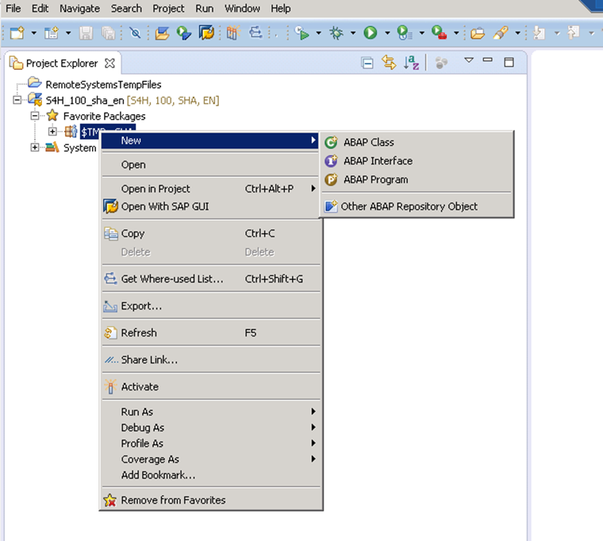
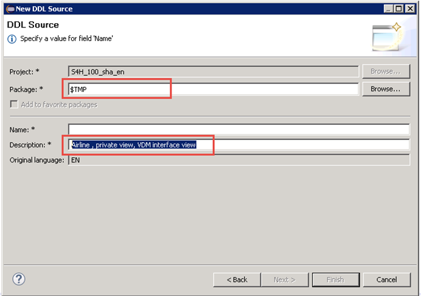
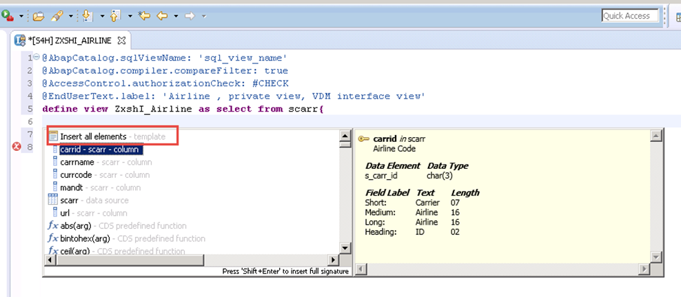
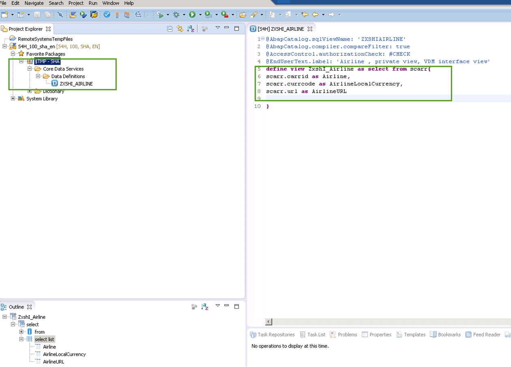
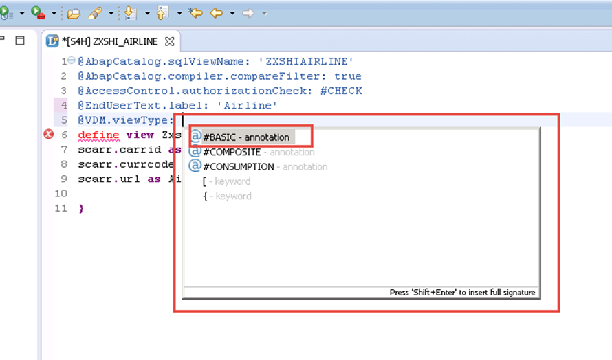
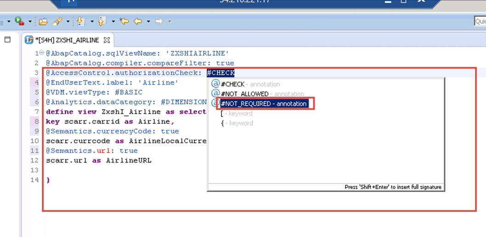
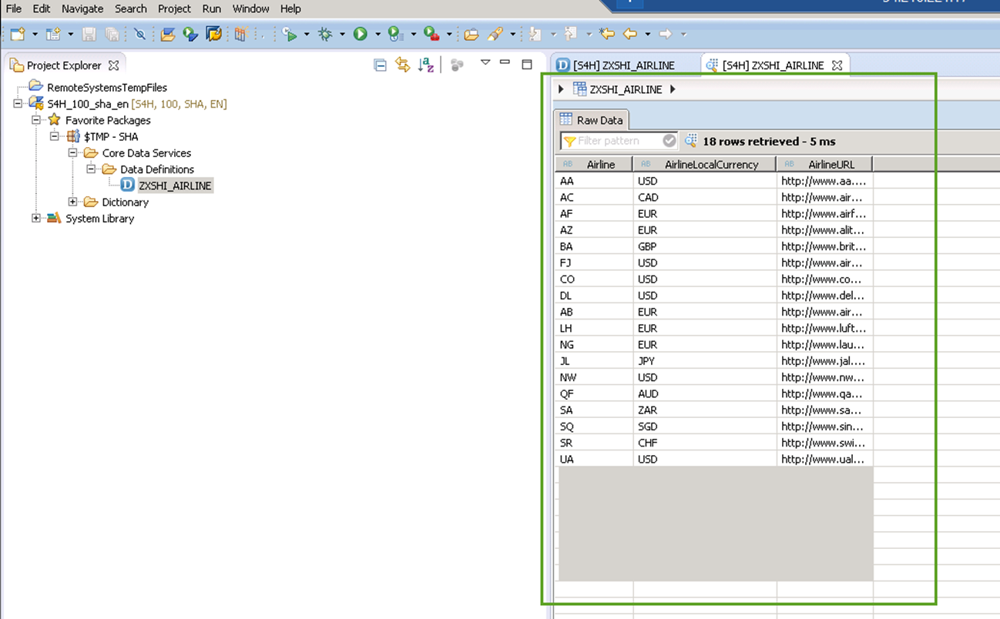

## Prerequisites  
 - **Proficiency:** Beginner
 - **Tutorials:** [Setting and starting an S4/HANA CAL instance and connecting to a Window instance on Amazon Web Services. ](http://www.sap.com/developer/tutorials/hana-setup-cloud.html)

## Next Steps
[Creating consumption view based on basic/interface view. ](http://www.sap.com/developer/tutorials/s4hana-cds-creating-consumption-view.html)


## Details
### You will learn  
How to create a basic view on top of data content in the demo table SCARR from ABAP system.

### Time to Complete
**15-25 Min**

---

[ACCORDION-BEGIN [Step 1: ](Prepare the ABAP perspective)]

To prepare the ABAP perspective, make sure that your Eclipse framework from the S/4HANA instance is opened in the ABAP perspective:


With the ABAP Eclipse perspective displayed, make sure you are in the **Project Explorer** tab. Here you will create in the `TMP-SHA` Package a new repository ABAP object for type DDL source.

Select the package `TMP-SHA`. Right-click on the selected package, select **New** and then select **Other ABAP Repository Object**. In the opened  ABAP Repository Object window scroll down to the folder **Core Data Services**. Expand the folder, select **DDL Source** and click **Finish**.  




In the new **DDL Source (Specify a value for field Name)** window, confirm that the values for **Project** and **Package** are as shown in the table below.

Field Name        | Value
:---------------- | :-------------
Project           | `S4H_100_sha_en`
Package           | `$TMP`




Enter the values for **Name** and **Description** then click **Finish**

Field Name        | Value
:---------------- | :-------------
Name              | `ZXSHI_AIRLINE`
Description       | `Northwind OData Service`


[DONE]
[ACCORDION-END]

[ACCORDION-BEGIN [Step 2: ](Change data source)]

In the **New DDL Source (Templates Select one of the available templates)** window, select **Define View** and click **Finish**.


Code for the newly created view named `ZXSHI_AIRLINE` is generated:


At line 5 of the generated code, replace `data source name` with the ABAP table `scarr`.  To achieve this, delete  the text `data source name` and then enter `sca` followed by the combination **Ctrl + Space bar**. A window will appear when you will select `scarr-data`.


[DONE]
[ACCORDION-END]

[ACCORDION-BEGIN [Step 3: ](Edit table)]

Open the ERP System (by clicking the SAP Log On icon) `S4H Client 100`.
Enter the User and Password values below and click **Enter**.

Field Name        | Value
:---------------- | :-------------
Name              | `sha`
Description       | `Welcome1`

   

In the next window enter the ABAP transaction `se16`, then click **Enter**.


In the next window enter `scarr` as the Table Name and click the **Table Contents** icon.


The content of the table `scarr` will be displayed. Confirm that the table has 18 entries.


[DONE]
[ACCORDION-END]

[ACCORDION-BEGIN [Step 4: ](Insert columns)]

Now switch back to the project explorer view of the Eclipse ABAP perspective. You will now enhance the code by inserting the columns of the table `scarr`. To achieve this, position the mouse pointer before the bracket near the table name `scarr`, press **Ctrl + Space bar**. Within the displayed window select **Insert all elements** and click **Enter**.



All the columns of the table `scarr` are now inserted in the previous code. Enhance each column with an Alias as following:

Line number       | Value
:---------------- | :-------------
Line 6:           | `scarr.carrid` as `Airline`,
Line 7:           | `scarr.currcode` as `AirlineLocalCurrency`
Line 8:           | `scarr.url` as `AirlineURL`

Expand the folder **`$TMP-SHA`** in the left panel, then  expand its subfolder **`Core Data Services`**. You will see in the  **`Data Definitions`** subfolder the newly created basic view named **`ZXSHI_AIRLINE`**.



[DONE]
[ACCORDION-END]

[ACCORDION-BEGIN [Step 5: ](Check view)]

To display the content of the basic view `ZXSHI_AIRLINE`, in the left panel, select and right-click on the view **`ZXSHI_AIRLINE`** and select **Open With >  Data Preview**.  


In the newly opened window, the content of the basic view **`ZXSHI_AIRLINE`** is displayed , showing 18 rows in three columns.


[DONE]
[ACCORDION-END]

[ACCORDION-BEGIN [Step 6: ](Edit fields)]

Switch back to the generated code of the basic view. There you will alter the lines marked in blue in the image below.


In the code area, replace text as follows:

Line number       | Value
:---------------- | :-------------
Line 1:           | `sql_view_name` with `ZXSHIAIRLINE`
Line 4:           | `Airline, private..` with `Airline`

After Airline, insert a new annotation as follows:

```abap
@VDM.view.Type:#BASIC
```





After line 5, insert line 6 with a new annotation:

```abap
@Analytics: DataCategory: #DIMENSION
```


[DONE]
[ACCORDION-END]

[ACCORDION-BEGIN [Step 7: ](Insert annotations)]

Insert two new annotations as follows:

- After the line including `scarr.carrid` as `Airline` insert `@Semantics.currencyCode: true` (see number 1 in the following screenshot).
- After the line including `scarr.currcode` as `AirlineLocalCurrency` insert `@Semantics.url: true` (see number 2 in the following screenshot).


In line 3 of the code, replace `CHECK` with `NOT_REQUIRED`, as shown here.



[DONE]
[ACCORDION-END]

[ACCORDION-BEGIN [Step 8: ](Check complete code)]

In the right panel, select and right-click on the view **`ZXSHI_AIRLINE`**, select **Open With > Data Preview**




> Note: You can copy this content from here and paste it to the code editor of your ABAP perspective as well instead of enhancing the generated code on your own:

```abap
@AbapCatalog.sqlViewName: 'ZXSHIAIRLINE'
@AbapCatalog.compiler.compareFilter: true
@AccessControl.authorizationCheck: #NOT_REQUIRED
@EndUserText.label: 'Airline'
@VDM.viewType: #BASIC
@Analytics.dataCategory: #DIMENSION
define view ZxshI_Airline as select from scarr{
key scarr.carrid as Airline,
@Semantics.currencyCode: true
scarr.currcode as AirlineLocalCurrency,
@Semantics.url: true
scarr.url as AirlineURL    
}
```

[DONE]
[ACCORDION-END]

### Notes
Although SAP offers trial editions for free you will still have to cover the costs for running these trial editions on AWS. This tutorial is part of the S/4HANA Core Data Services. More information can be found in these documents.

- [Amazon Web Services](http://aws.amazon.com/)
- [SAP Cloud Appliance Library (CAL)](https://scn.sap.com/community/cloud-appliance-library)
- [Alternative AWS Deployment for SAP Trials provided as Virtual Appliance](https://scn.sap.com/docs/DOC-46908)
- [Virtual Private Cloud with VPN Access for SAP Trials provided as Virtual Appliance](https://scn.sap.com/docs/DOC-46629)
