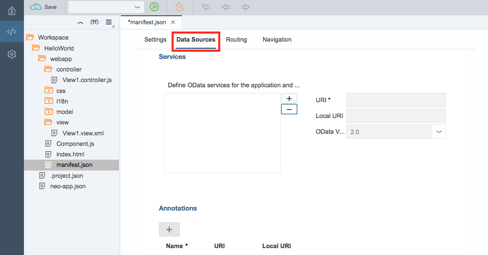
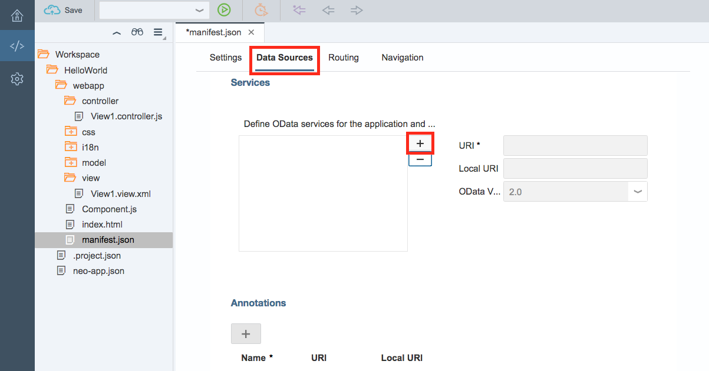
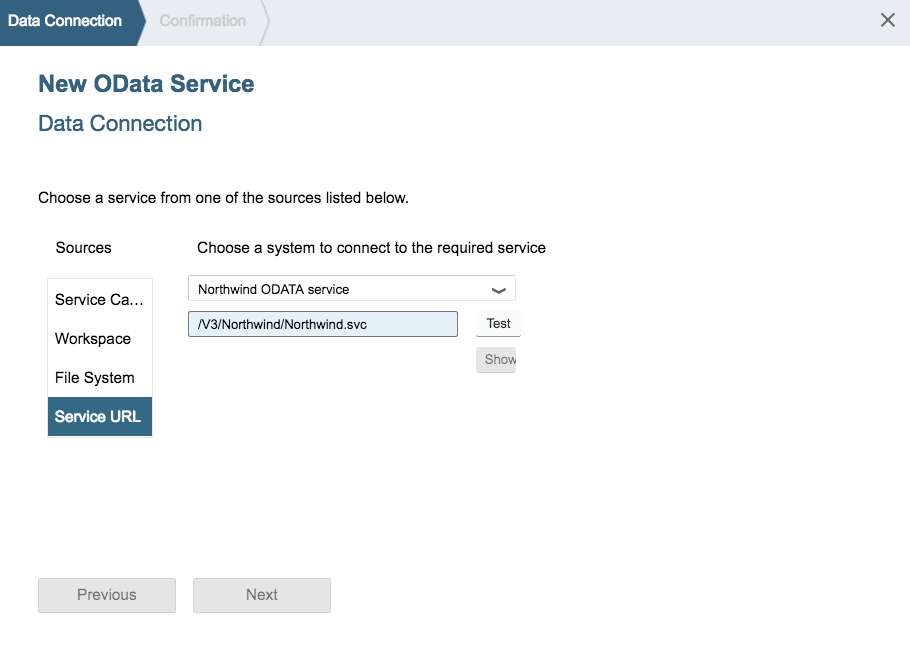
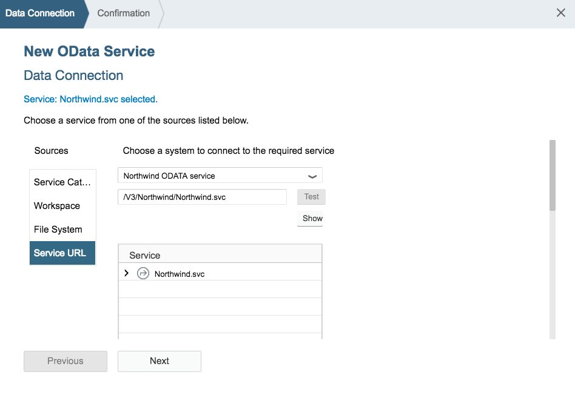
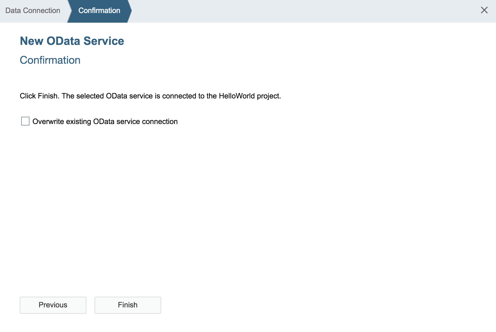
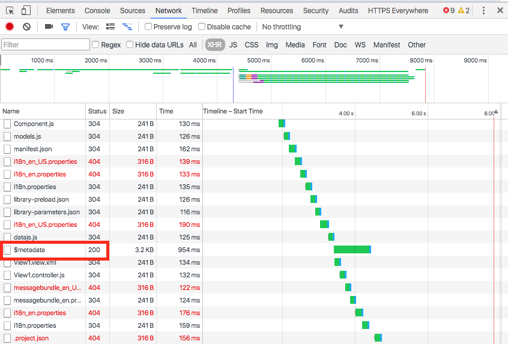

## Prerequisites  
 - **Proficiency:** Beginner
 - **Tutorial**: [Create an empty UI5 Web IDE project](https://www.sap.com/developer/tutorials/sapui5-webide-create-project.html)

## Next Steps
 - [Add a list to the current view](https://www.sap.com/developer/tutorials/sapui5-webide-add-list.html)

## Details
### You will learn  
Now that you have set up a Destination in the SAP Cloud Platform (HCP) cockpit, you will connect that destination to your local application.  

### Time to Complete
**15 Minutes**.

---
>  **Web IDE** If you don't have the Web IDE open, follow these steps: [Enable and open the SAP Cloud Platform Web IDE](https://www.sap.com/developer/tutorials/sapui5-webide-open-webide.html)

---
There are three steps to connect the OData service to your application.  

1.  Define the Data Source in your `mainfest.json` file.  
2.  Create a Model.   (The Model is the data source, based on [the Model-View-Controller architecture](https://blog.codinghorror.com/understanding-model-view-controller/)).  
3.  Test the application

---
### Define the Data source

In a [previous tutorial](https://www.sap.com/developer/tutorials/hcp-create-destination.html) the OData test service called "Northwind" was set up for all SAP Cloud Platform applications.  Next, this specific application must connect to that "Destination".  

1.  Open the `webapp/mainfest.json` file, by double clicking on the file.

    > To open a folder in the Web IDE, just click on the folder icon.  It will expand to show the contents.

    .

    > If you open the file, and you get a code editor (and not the form editor shown below), click the **Descriptor Editor** link at the bottom of the page.  This will change to the Code Editor.

    

2.  Click the **Data Sources** tab at the top of the screen.

    

3.  Click the **+** icon next to the *Define OData services for the application and...* box.

    

4.  From the **Sources** list, choose **Service URL**.  Then choose the following:

    |               |                                    |
    | -------------:| ---------------------------------- |
    | Drop-down Box | `Northwind ODATA Service`          |
    | URI           | `/V3/Northwind/Northwind.svc`      |

    

5.  Click the **Test** button to test the service.  If the data is correct, you should see this screen appear.  Click **Next** to continue.

    

6.  On the Confirmation Screen, do not select Overwrite.  Click on **Finish**.

    

---
### Create the model

Now that the application has a connection to the "Northwind" destination, the next step is to create a data object (called a "model").  This object acts as the interface between the data coming from the web and the rest of the code in the application.

There are two ways to create a model:  in the JavaScript code, or by using the `mainfest.json` file.  Adding the model to the `manifest.json` file will set one up automatically.  

> **NOTE**  To create the model directly in JavaScript, read [the model help documentation](https://sapui5.netweaver.ondemand.com/docs/guide/5278bfd38f3940b192df0e39f2fb33b3.html).

1.  Open the `manifest.json` file, and select the **Models** link at the top of the screen:

    

2.  Click the **+** button to create a new model.

    

3. In the *New Model* dialog box, select the following:

    |    |    |
    |---:|--- |
    | Model Name                                | *(leave blank)*       |
    | Model Source                              | Select Data Source    |
    | `Dropdown`                                | `Northwind.svc`       |
    | Set as default model for the application  | *checked*             |

    Then click the **OK** button to accept.

    

4.  In the next screen, modify the `Binding Mode` property (on the lower right hand side).  Click the arrow, and select `Default` as the binding mode.

    

5. The finished model screen will look like this.  Click **Save** to save this file.

    

    > If your file name has a * next to it, the file has not been saved.  This can cause problems when you run your application.  Make sure all your files are saved before you run!

    

----
## Test the application

1.  Test your application by clicking on **RUN**     

    A new browser window will open.  The screen should look like this:

    

2.  Next, check to make sure the browser is receiving the data.  The web page will receive the data, but nothing will appear on the screen.  (We will set up the screen display in the next few tutorials).  

	To check the data, use the browser tools and view the data coming from the server.
	> *Why are we using Google Chrome?*  Google chrome has built in development tools that make it easy to debug and work with web pages.  If you are not using Google Chrome, [download it now](https://www.google.com/chrome/browser/desktop/).

	Right click on the web page, and choose **Inspect**

    

3.  The inspector will appear.  Click on the **Network** tab to view the network traffic for the application.

    

4.  To view all the network traffic, reload the page.  

    The network traffic will appear as the page is loading...
    >*What about the red text?* Several files will appear in red.  This is normal, as we have not set up that part of the application.

5.  Scroll down until you find the *$metadata* item.  

    > **NOTE** Typing in `metadata` to the filter box in upper right corner will make it easy to find the correct row.

    

6.  Click on *$metadata*, then click the **Preview** tab.

    This will show you the data coming from the server to the browser.  If you see this, the data is working.  You are ready to move on to the next step of the tutorial.

    

## Troubleshooting
 - **Missing a file?**  If the list of files doesn't match the picture, you may have used the wrong template when you created the project.  Delete the project, and start the [Create a new project](https://www.sap.com/developer/tutorials/sapui5-webide-create-project.html) tutorial again.

 - **$metadata file not listed?**  This means one of the files in your project is incorrect.  Check the files, and make sure no red X marks appear in the left hand column.  These indicate a problem with the file syntax.  Check the pictures carefully.

 - **The `Northwind` system does not appear in the drop down box.**  This can happen when the Web IDE is "out of sync" with the server.  Reload the Web IDE (by clicking the reload button in your browser).  You will come back to the same place, and you can start the steps to create a new OData service again.

 - **Don't forget to save your files!**  If a file name has a * next to it, the file isn't saved.  

## Next Steps

- **Tutorial** Part 3: [Add a list to the current view](https://www.sap.com/developer/tutorials/sapui5-webide-add-list.html)
