## Prerequisites  
 - [Working with Document Store Engine in SAP Vora](http://www.sap.com/developer/tutorials/vora-cal-zeppelin7.html)

## Next Steps
 - Select a tutorial from the [Tutorial Navigator](http://www.sap.com/developer/tutorial-navigator.html) or the [Tutorial Catalog](http://www.sap.com/developer/tutorials.html)

## Details
### You will learn  
You will learn how to use Data Browser and Modeler from Vora Tools.

### Time to Complete
**15 Min**

---

[ACCORDION-BEGIN [Step 1: ](SAP Vora Tools)]
The SAP Vora tools provide a data browser for viewing and exporting data in tables and views, an SQL editor for creating and running SQL scripts, and a modeler for creating data models.

SAP Vora makes available OLAP-style capabilities for data on Hadoop, in particular, a hierarchy implementation that allows you to define hierarchical data structures and perform complex computations on different levels of data.

[DONE]
[ACCORDION-END]

[ACCORDION-BEGIN [Step 2: ](Accessing the Tools)]
You can access the SAP Vora tools via web browser on the port 9225 of the Vora host: `http://<IP_ADDRESS>:9225`. In your SAP Vora, developer edition, you can use user `vora`.

The initial screen appears as follows.
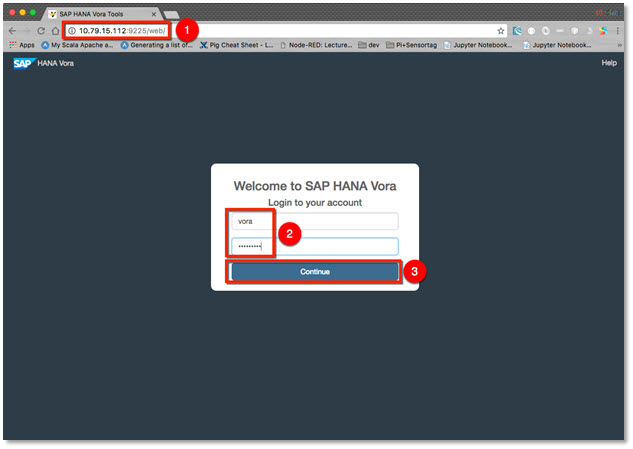

You will be presented with the initial landing page once logged in successfully.

[DONE]
[ACCORDION-END]

[ACCORDION-BEGIN [Step 3: ](Data Browser)]
Continue by selecting the **Data Browser**. This node will give a list of all object created in the platform (from previous Zeppelin tutorials) you can also preview data.

Expand the tree views of Vora In-Memory Engine and Vora Disk Engine.
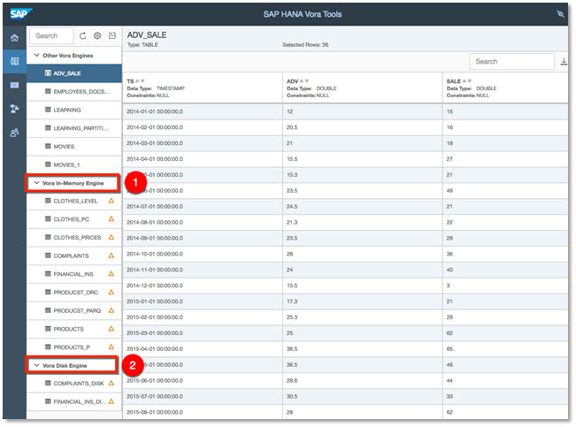

Continue by registering the tables: `PRODUCTS` in the In-Memory Engine and `COMPLAINTS_DISK` in the Disk Engine. You will be using the Vora Modeling tool to create a model, querying data across two engines.
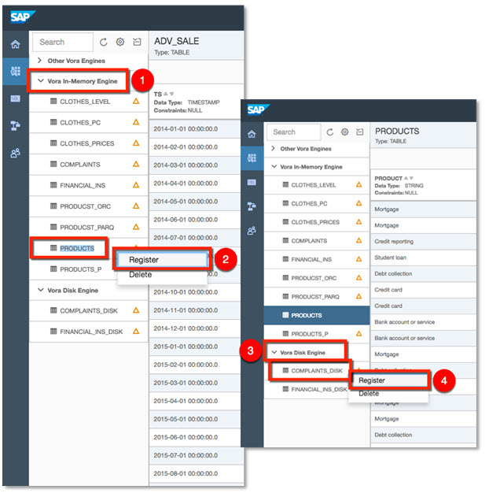

Table registration will take a few moments.

[DONE]
[ACCORDION-END]

[ACCORDION-BEGIN [Step 4: ](Modeler)]
Select the **Modeler** button once both tables are registered. This is where you will be doing the bulk of the work now.
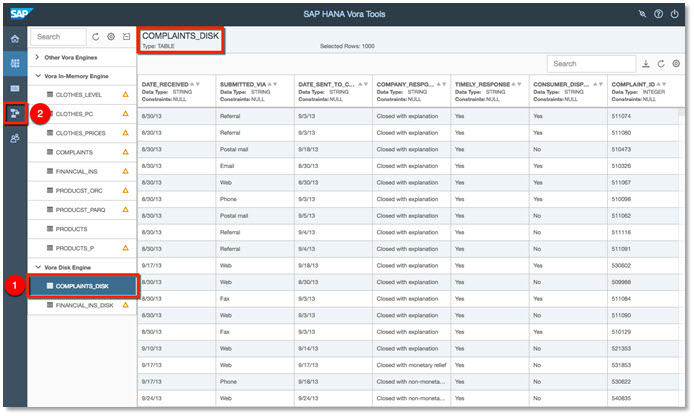

Expand the `Vora In-Memory Engine` and `Vora Disk Engine` tree view once the Modeler tool is loaded.
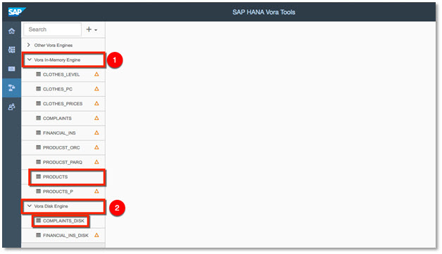

Create a new SQL View called `V_CUSTOMER_ISSUES` by clicking on the **`Add`** button.
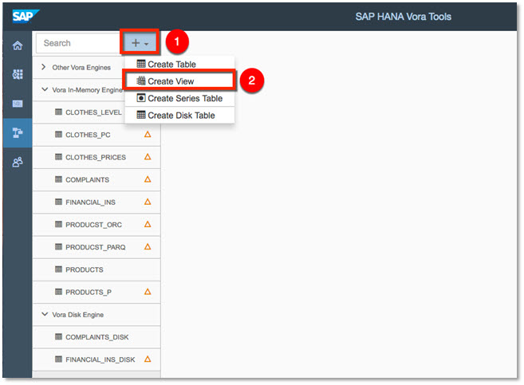

Select View Type `SQL` and name it `V_CUSTOMER_ISSUES`.
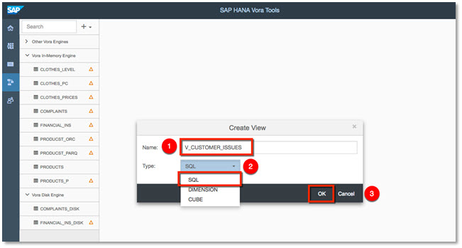

Once the view is created, the next step is to add Data Sources (two tables from previous steps). Click on the **Add Data Source** button. You can start typing the table name or supply a `*` to list all known Data Sources as shown below.
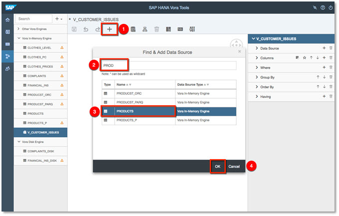

Repeat to add second table.
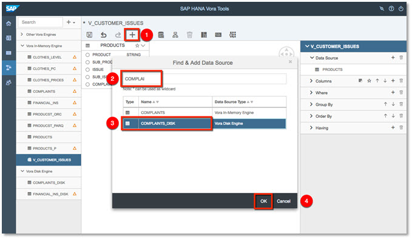

Continue by selecting desired columns as output by clicking on the highlighted radio buttons next to each required column. Note that the selected output columns will appear in the right hand pane **Columns**.
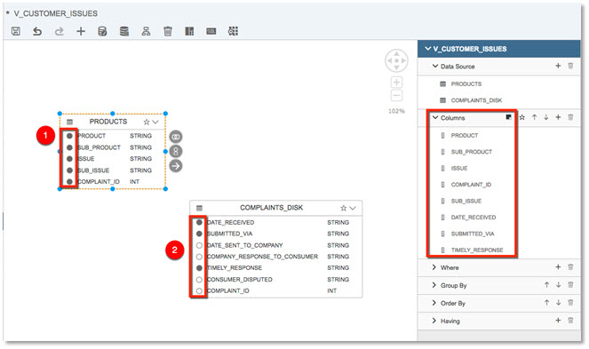

Join the two tables on the common column `COMPLAINT_ID`. First use your mouse pointer to select the `COMPLAINT_ID` column in the `PRODUCTS` table. Hold the mouse button down while dragging it to the `COMPLAINTS_DISK` table and drop it on the `COMPLAINT_ID` column.
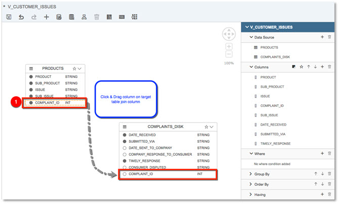

The **Join Definition** window appears. Change the type to `Left Outer` and select **OK** when done.
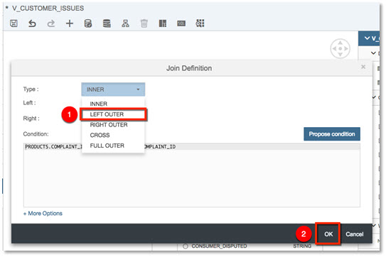

Save the view. Now preview what you have done so far by clicking on the **Preview** button as demonstrated below. Note the join linking the two tables.
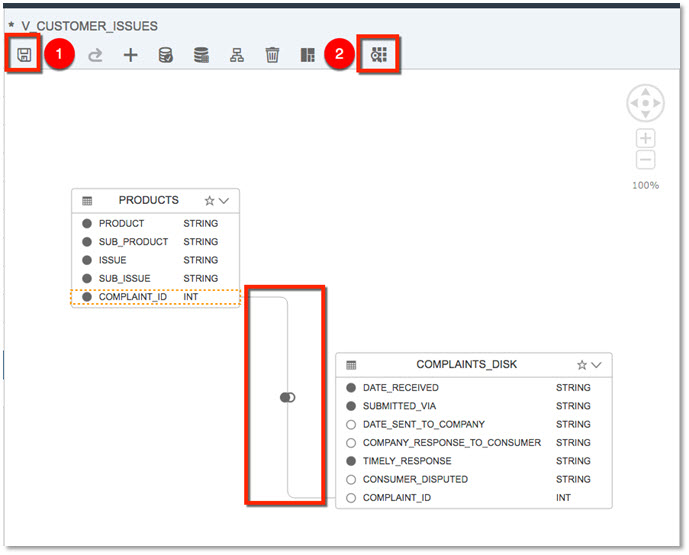

Successful Data Preview.
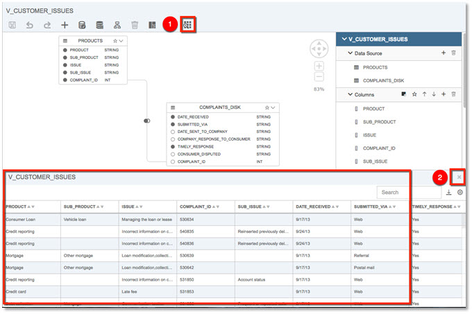

Add a 'where' condition to filter for issues logged via the `Web` by using the right hand pane. Look for **Where** and click the **+** button. The **Where Condition** window appears. Enter condition by selecting options or by typing the condition in the **Expression** box.
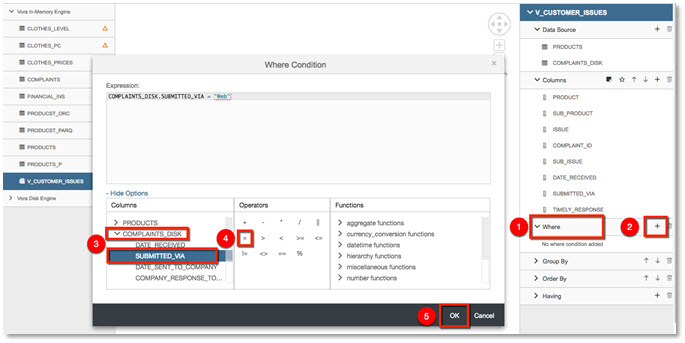

Save your changes and do a **Data Preview**.
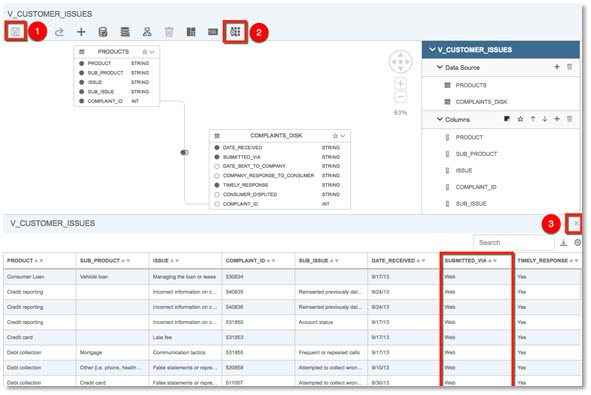

Count the issues logged by `PRODUCT` by modifying the existing view. Start by select only `PRODUCT` as output column. You can deselect unwanted columns by clicking on them.
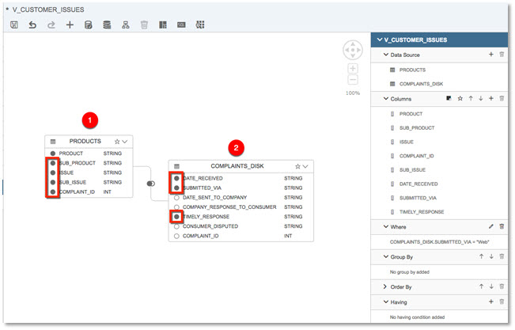

Add a calculated column and count each `COMPLAINT_ID`. Add `PRODUCT` to the **Group By** clause.
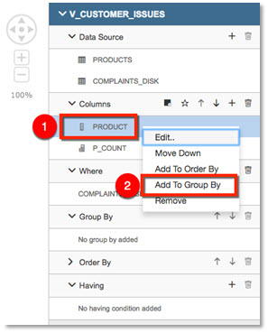

Save our changes and do a **Data Preview**.
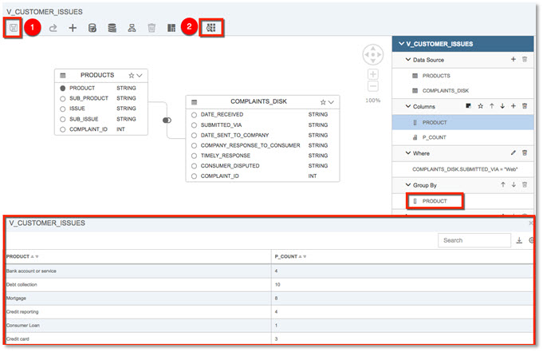

The modelled view is now ready for reporting. Click on the **Data Browser** in Vora Tools. You will notice the newly created object under **Vora In-Memory Engine**.
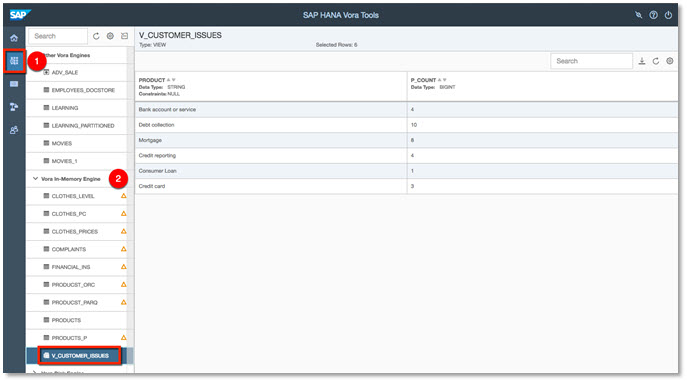

[DONE]
[ACCORDION-END]

## Next Steps
- Select a tutorial from the [Tutorial Navigator](http://www.sap.com/developer/tutorial-navigator.html) or the [Tutorial Catalog](http://www.sap.com/developer/tutorials.html)
