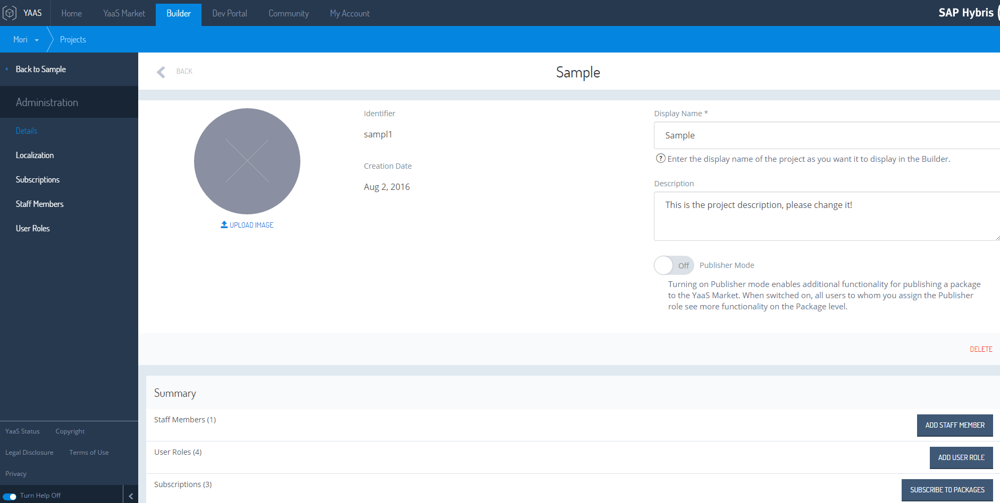
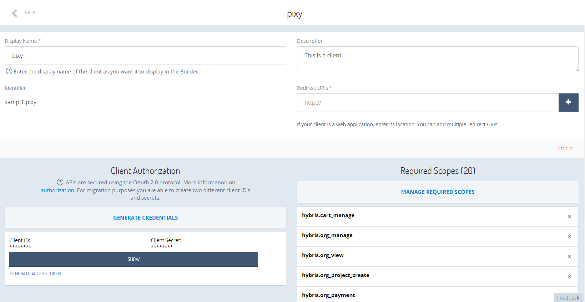
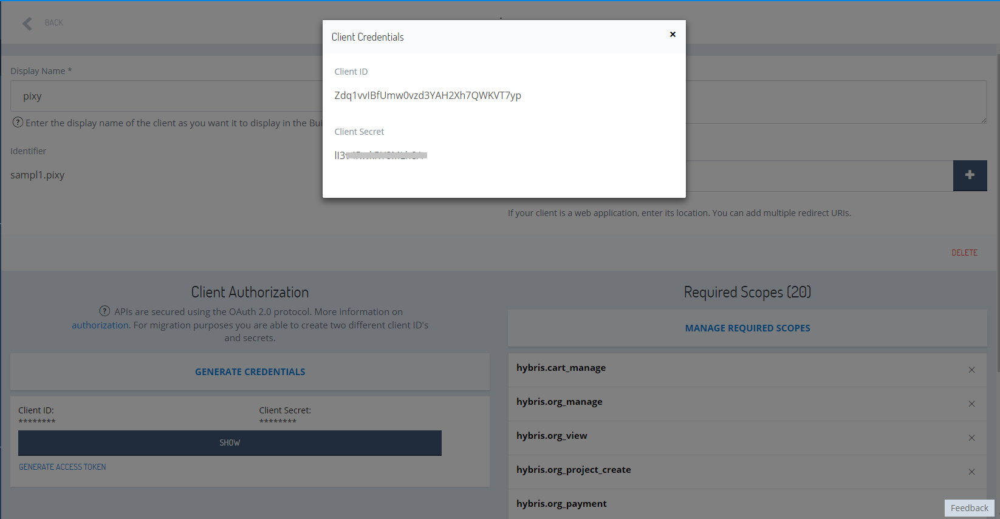
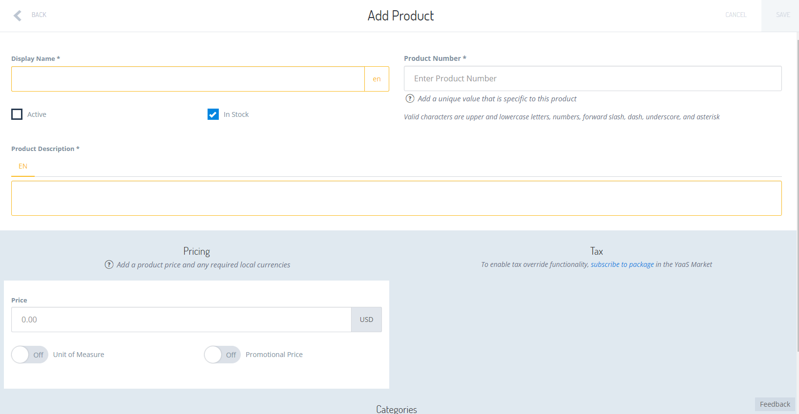
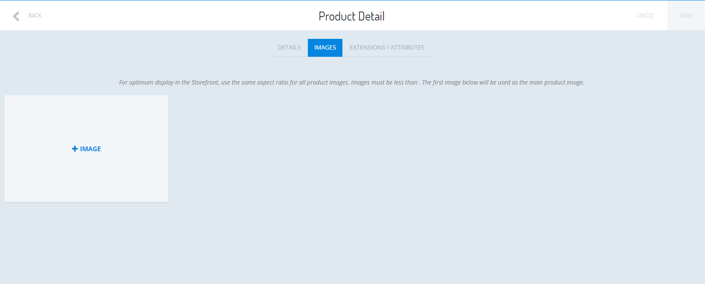

## Prerequisites  
- **Proficiency:** Intermediate
- **Background Knowledge:** If you are not already familiar with [Node.js](https://www.youtube.com/watch?v=pU9Q6oiQNd0), follow this link to learn more. You will use it in this tutorial. The YaaS Storefront is based on  [Angular](https://docs.angularjs.org/guide/directive) and [Restangular](https://github.com/mgonto/restangular#starter-guide). If you are not already familiar with them and would like to dive into the code, you can follow the provided links to start learning.
- **Tutorials:**
- Getting Started with YaaS
- Download and Run the Default YaaS Storefront
- Extend the YaaS Storefront's Functionality With a Micro Service

## Next Steps
- Deploy a Micro Service Built on YaaS on the SAP Cloud Platform

## Details
### You will learn  
In this tutorial you will use our own YaaS Project which you created earlier instead of the default one.

### Time to Complete
**20 Min**.

---

[ACCORDION-BEGIN [Step 1: ](Complete Getting Started with YaaS)] 

If you have not completed the Getting Started with YaaS tutorial, please do it now. This is necessary in order to follow the next steps.   

[DONE]
[ACCORDION-END]

[ACCORDION-BEGIN [Step 2: ](Set project ID and client ID)] 

Take note of the YaaS **Project's identifier** and the YaaS **Client's identifier** and place these as the `PROJECT_ID` and `CLIENT_ID` values in the `gruntfile.js` in the `folder(1)` directory which you created in the previous tutorials. This is the root directory of your `yaas-storefront` project.

- You Can find **Project's identifier** in the **Builder** under the **Administration** tab when you open your project.

    

- You can find the client identifier by selecting your client from the list of **Clients**.

    

- In the **Client Authorization** section, use the **SHOW** button. Now you should be able to see the **Client ID**.

    

[DONE]
[ACCORDION-END]

[ACCORDION-BEGIN [Step 3: ](Rebuild the Storefront)] 

Rebuild the Storefront by running the `grunt build` command from `folder(1)` directory.

[DONE]
[ACCORDION-END]

[ACCORDION-BEGIN [Step 4: ](Rerun your Storefront)] 

Rerun your Storefront by running the `npm start` command from `folder(1)` directory. The client will now be talking with your YaaS Project.

[DONE]
[ACCORDION-END]

[ACCORDION-BEGIN [Step 5: ](Add products)] 

Add some products to start populating your Storefront with material.

- Go back to the builder and click on product / new product.
- Add a name, an identifier, a price, a description and check active.

    

- Click on save.
- (Optional) Add an image, click on save.

    

- Follow the same steps if you want to create additional products.
- In the end if you reload your storefront, you will be able to see the products you added.

> NOTE: It is important to set your products as **active**, otherwise they will not appear in your online store.

[DONE]
[ACCORDION-END]

### Summary
In this tutorial, you replaced the default storefront project credentials with your own YaaS project credentials. You added customized products to your storefront.    

## Next Steps
- Deploy a Micro Service Built on YaaS on the SAP Cloud Platform

### Optional
Create a category and assign your products to it.
- Go back to the Builder and open Categories.
- Create a category and you can add image for it.
- Add sub categories to your category.
- Assign products to categories
